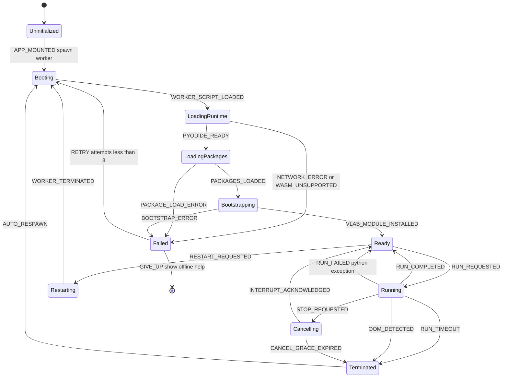
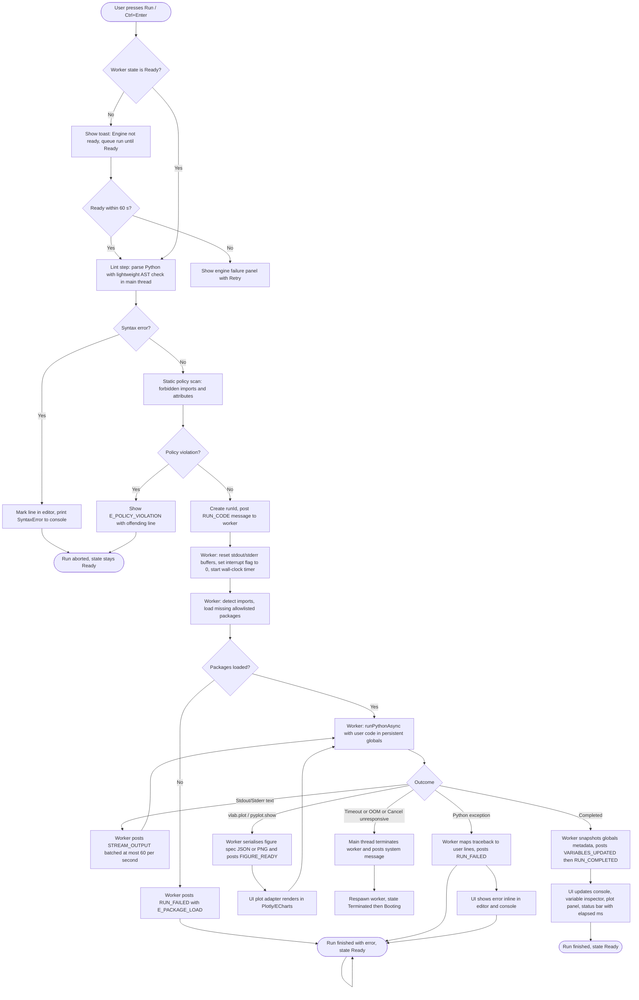
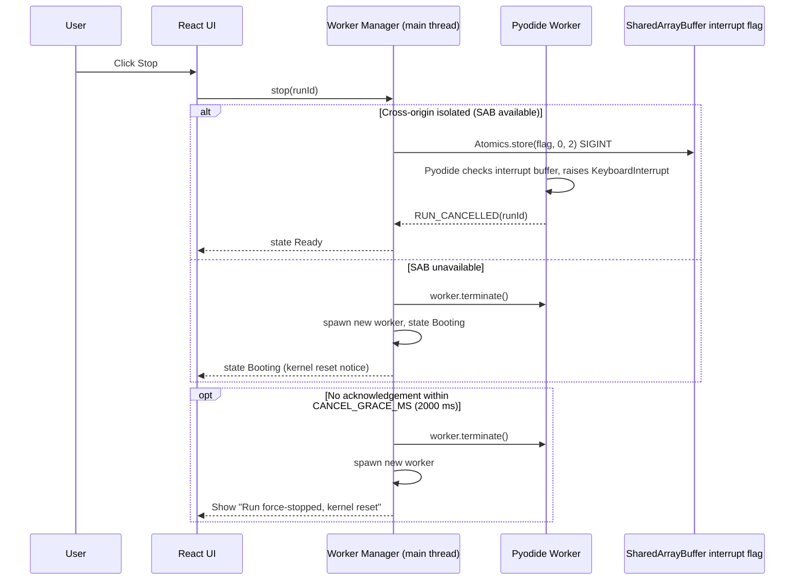
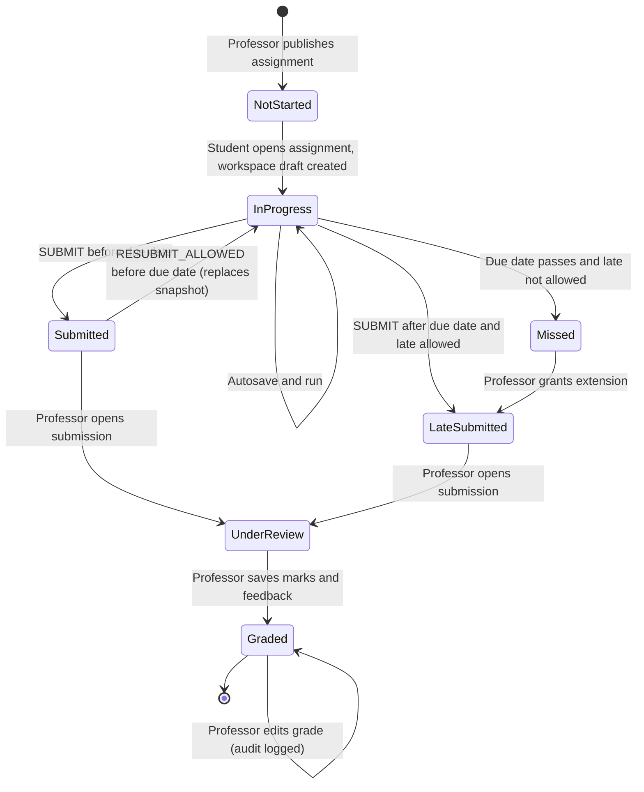
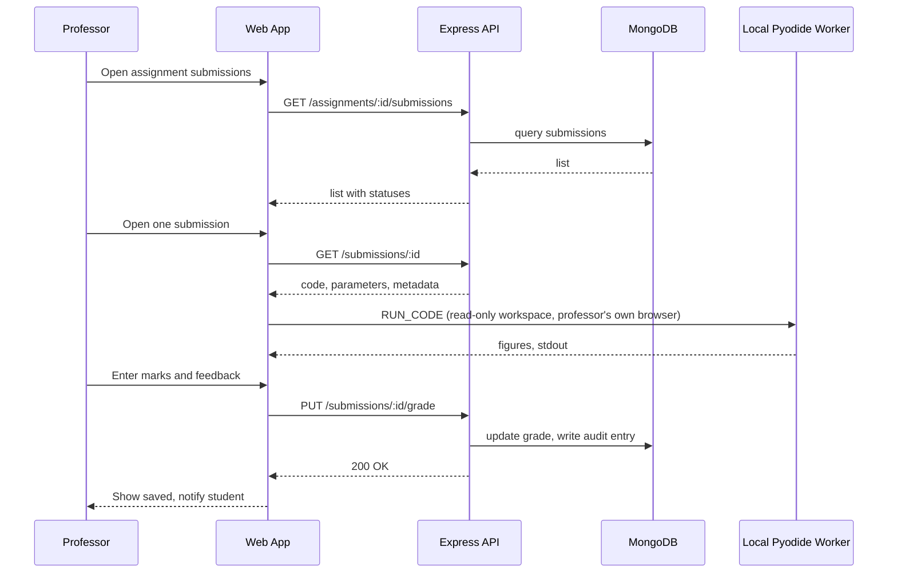
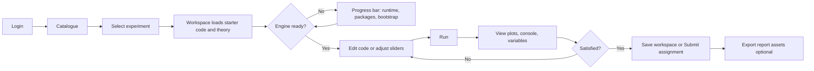

# V-Lab ECE: User Flows

All diagrams use Mermaid. Node names are normative; implementations of state machines (e.g., XState machines in `apps/web/src/state/machines/`) must use the **same state and event names**.

## 1. Pyodide Worker Lifecycle (State Machine)



**Rules**

- `Ready`, `Running`, `Cancelling`, and `Terminated` are the only states in which the UI shows the editor as enabled; Run is disabled outside `Ready`.
- On `Terminated` the console prints a red system message explaining the reason (timeout, out of memory, cancelled) and the kernel variables are reset.
- Retry uses exponential backoff 1 s, 2 s, 4 s.

## 2. Workspace Compilation / Execution Flow (End-to-End)



(Note: `END2` is a terminal marker; implementations must not loop.)

## 3. Cooperative Cancellation Sequence



## 4. Authentication Flow

```mermaid
flowchart TD
    A([Visit /]) --> B{Has valid access token in memory?}
    B -- Yes --> H[Load dashboard by role]
    B -- No --> C{Refresh cookie present?}
    C -- Yes --> D[POST /api/auth/refresh]
    D --> E{200 OK?}
    E -- Yes --> H
    E -- No --> F[Redirect /login]
    C -- No --> G{Public route?}
    G -- Yes --> G1[Guest mode: run public experiments, saving disabled]
    G -- No --> F
    F --> I[Submit email and password]
    I --> J[POST /api/auth/login]
    J --> K{Credentials valid and account active?}
    K -- No --> L[Show generic error, rate-limit counter increments] --> F
    K -- Yes --> M[Receive access token JSON and refresh cookie httpOnly]
    M --> H
    H --> N{Role}
    N -- student --> N1[/student: catalogue, assignments, workspaces]
    N -- professor --> N2[/professor: assignments, submissions, analytics]
    N -- admin --> N3[/admin: users, courses, audit]
```

## 5. Student Assignment Lifecycle



## 6. Professor Grading Flow



## 7. Experiment Session Flow (Student, happy path)



## 8. Error and Recovery Matrix

| Failure                 | Detection                        | User-visible behaviour                           | Automatic recovery                                           |
| ----------------------- | -------------------------------- | ------------------------------------------------ | ------------------------------------------------------------ |
| WebAssembly unsupported | Feature check at boot            | Compatibility page with supported browsers       | None                                                         |
| Runtime download fails  | Fetch error or integrity failure | Engine failure panel, Retry button               | Retry x3 with backoff                                        |
| Python exception        | Worker `RUN_FAILED`              | Inline marker + traceback                        | State `Ready`                                                |
| Infinite loop           | Timeout or Stop                  | System message "Run stopped"                     | Interrupt or terminate and respawn                           |
| Out of memory           | Watchdog or worker `error` event | System message with advice to reduce array sizes | Terminate, respawn                                           |
| API unreachable on save | Fetch fails                      | Toast "Saved locally, will sync"                 | Retry queue, IndexedDB draft retained                        |
| Token expired           | 401                              | Silent refresh                                   | One refresh attempt, else redirect to login preserving draft |
