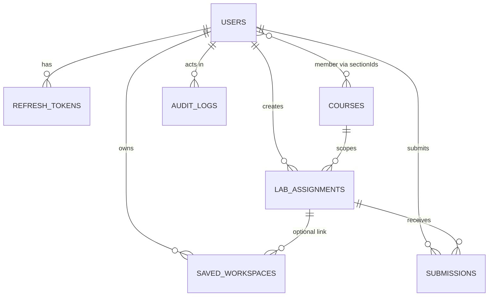

# V-Lab ECE: Database Design (MongoDB Atlas, Mongoose 8)

> **Agent instruction:** Implement each collection as a Mongoose model in `apps/api/src/models/`, with `timestamps: true`, `strict: "throw"`, and `versionKey: false`. Apply the `$jsonSchema` validators below as **collection validators** in a migration script (`apps/api/src/scripts/apply-validators.ts`) with `validationLevel: "strict"` and `validationAction: "error"`. Create all indexes with `autoIndex: false` in production; indexes are created by `apps/api/src/scripts/ensure-indexes.ts`.

## 1. Conventions

- `_id`: `ObjectId`. API exposes it as string `id`.
- Timestamps: BSON `Date` in UTC (`createdAt`, `updatedAt`).
- Emails: stored lowercase and trimmed.
- Soft delete: `isActive: false` for users; hard delete only through the privacy erase flow (`PRIVACY.md`, Batch 4).
- Experiment definitions live in the repo (`packages/experiments`), **not** the DB. The DB references `experimentId` strings (pattern `^(SS|NT|DSP|DIP|BEE|ACS|SSP)-\d{2}$`).
- Collection list: `users`, `refresh_tokens`, `courses`, `lab_assignments`, `saved_workspaces`, `submissions`, `audit_logs`, `experiment_settings`, `rate_limits`.
- Size budget on Atlas M0 (512 MB): average 50 KB per user including workspaces; plan for ≤ 1,000 users.

## 2. `users`

```json
{
  "$jsonSchema": {
    "bsonType": "object",
    "title": "User",
    "required": [
      "email",
      "passwordHash",
      "name",
      "role",
      "isActive",
      "createdAt",
      "updatedAt",
      "tokenVersion"
    ],
    "additionalProperties": false,
    "properties": {
      "_id": { "bsonType": "objectId" },
      "email": {
        "bsonType": "string",
        "pattern": "^[a-z0-9._%+-]+@[a-z0-9.-]+\\.[a-z]{2,}$",
        "maxLength": 254
      },
      "passwordHash": { "bsonType": "string", "pattern": "^\\$2[aby]\\$12\\$.{53}$" },
      "name": { "bsonType": "string", "minLength": 1, "maxLength": 100 },
      "role": { "enum": ["student", "professor", "admin"] },
      "rollNo": { "bsonType": "string", "pattern": "^[0-9]{2}[A-Z]{2}[0-9]{4,6}$" },
      "programme": { "enum": ["BTech", "MTech", "PhD"] },
      "batchYear": { "bsonType": "int", "minimum": 2015, "maximum": 2100 },
      "sectionIds": { "bsonType": "array", "maxItems": 20, "items": { "bsonType": "objectId" } },
      "isActive": { "bsonType": "bool" },
      "tokenVersion": { "bsonType": "int", "minimum": 0 },
      "failedLoginCount": { "bsonType": "int", "minimum": 0 },
      "lockedUntil": { "bsonType": ["date", "null"] },
      "lastLoginAt": { "bsonType": ["date", "null"] },
      "passwordChangedAt": { "bsonType": ["date", "null"] },
      "passwordReset": {
        "bsonType": ["object", "null"],
        "required": ["tokenHash", "expiresAt"],
        "properties": {
          "tokenHash": { "bsonType": "string", "minLength": 64, "maxLength": 64 },
          "expiresAt": { "bsonType": "date" }
        }
      },
      "preferences": {
        "bsonType": "object",
        "additionalProperties": false,
        "properties": {
          "theme": { "enum": ["system", "light", "dark"] },
          "editorFontSize": { "bsonType": "int", "minimum": 10, "maximum": 24 },
          "liveRun": { "bsonType": "bool" }
        }
      },
      "createdAt": { "bsonType": "date" },
      "updatedAt": { "bsonType": "date" }
    }
  }
}
```

**Rules:** `rollNo`, `programme`, `batchYear` are required when `role == "student"` (enforced in Mongoose pre-validate, since `$jsonSchema` conditional logic is awkward). `tokenVersion` increments on password change, deactivation, and role change; the access-token verifier rejects tokens whose `tv` claim differs.

**Indexes**
| Index | Options | Purpose |
|---|---|---|
| `{ email: 1 }` | unique | Login, uniqueness |
| `{ rollNo: 1 }` | unique, `partialFilterExpression: { rollNo: { $exists: true } }` | Student lookup |
| `{ role: 1, isActive: 1 }` | | Admin lists |
| `{ sectionIds: 1 }` | | Section membership |
| `{ batchYear: 1, programme: 1 }` | | Bulk operations |

## 3. `courses` (supporting collection)

```json
{
  "$jsonSchema": {
    "bsonType": "object",
    "required": ["code", "name", "level", "enabled", "sections"],
    "additionalProperties": false,
    "properties": {
      "_id": { "bsonType": "objectId" },
      "code": { "enum": ["SS", "NT", "DSP", "DIP", "BEE", "ACS", "SSP"] },
      "name": { "bsonType": "string", "maxLength": 120 },
      "level": { "enum": ["UG", "PG"] },
      "enabled": { "bsonType": "bool" },
      "sections": {
        "bsonType": "array",
        "maxItems": 30,
        "items": {
          "bsonType": "object",
          "required": ["_id", "name", "academicYear", "professorIds"],
          "additionalProperties": false,
          "properties": {
            "_id": { "bsonType": "objectId" },
            "name": { "bsonType": "string", "maxLength": 40 },
            "academicYear": { "bsonType": "string", "pattern": "^20[0-9]{2}-[0-9]{2}$" },
            "professorIds": { "bsonType": "array", "items": { "bsonType": "objectId" } }
          }
        }
      },
      "createdAt": { "bsonType": "date" },
      "updatedAt": { "bsonType": "date" }
    }
  }
}
```

Indexes: `{ code: 1 }` unique; `{ "sections._id": 1 }`; `{ "sections.professorIds": 1 }`.

## 4. `lab_assignments`

```json
{
  "$jsonSchema": {
    "bsonType": "object",
    "title": "LabAssignment",
    "required": [
      "courseId",
      "courseCode",
      "experimentId",
      "experimentVersion",
      "title",
      "createdBy",
      "sectionIds",
      "dueAt",
      "maxMarks",
      "status",
      "allowLate",
      "allowResubmit",
      "createdAt",
      "updatedAt"
    ],
    "additionalProperties": false,
    "properties": {
      "_id": { "bsonType": "objectId" },
      "courseId": { "bsonType": "objectId" },
      "courseCode": { "enum": ["SS", "NT", "DSP", "DIP", "BEE", "ACS", "SSP"] },
      "experimentId": { "bsonType": "string", "pattern": "^(SS|NT|DSP|DIP|BEE|ACS|SSP)-[0-9]{2}$" },
      "experimentVersion": { "bsonType": "int", "minimum": 1 },
      "title": { "bsonType": "string", "minLength": 3, "maxLength": 160 },
      "instructions": { "bsonType": "string", "maxLength": 20000 },
      "createdBy": { "bsonType": "objectId" },
      "sectionIds": {
        "bsonType": "array",
        "minItems": 1,
        "maxItems": 20,
        "items": { "bsonType": "objectId" }
      },
      "publishAt": { "bsonType": ["date", "null"] },
      "dueAt": { "bsonType": "date" },
      "allowLate": { "bsonType": "bool" },
      "lateUntil": { "bsonType": ["date", "null"] },
      "allowResubmit": { "bsonType": "bool" },
      "maxMarks": { "bsonType": "double", "minimum": 1, "maximum": 1000 },
      "status": { "enum": ["draft", "published", "closed"] },
      "starterCodeOverride": { "bsonType": ["string", "null"], "maxLength": 200000 },
      "parameterOverrides": { "bsonType": "object" },
      "extensions": {
        "bsonType": "array",
        "maxItems": 500,
        "items": {
          "bsonType": "object",
          "required": ["userId", "dueAt", "grantedBy", "grantedAt"],
          "additionalProperties": false,
          "properties": {
            "userId": { "bsonType": "objectId" },
            "dueAt": { "bsonType": "date" },
            "grantedBy": { "bsonType": "objectId" },
            "grantedAt": { "bsonType": "date" }
          }
        }
      },
      "createdAt": { "bsonType": "date" },
      "updatedAt": { "bsonType": "date" }
    }
  }
}
```

**Indexes**
| Index | Purpose |
|---|---|
| `{ sectionIds: 1, status: 1, dueAt: 1 }` | Student list (assignments for my sections) |
| `{ createdBy: 1, createdAt: -1 }` | Professor list |
| `{ courseId: 1, status: 1 }` | Course view |
| `{ "extensions.userId": 1 }` | Extension lookup |

## 5. `saved_workspaces`

```json
{
  "$jsonSchema": {
    "bsonType": "object",
    "title": "SavedWorkspace",
    "required": [
      "userId",
      "name",
      "experimentId",
      "experimentVersion",
      "files",
      "sizeBytes",
      "revision",
      "createdAt",
      "updatedAt"
    ],
    "additionalProperties": false,
    "properties": {
      "_id": { "bsonType": "objectId" },
      "userId": { "bsonType": "objectId" },
      "assignmentId": { "bsonType": ["objectId", "null"] },
      "name": { "bsonType": "string", "minLength": 1, "maxLength": 100 },
      "experimentId": { "bsonType": "string", "pattern": "^(SS|NT|DSP|DIP|BEE|ACS|SSP)-[0-9]{2}$" },
      "experimentVersion": { "bsonType": "int", "minimum": 1 },
      "files": {
        "bsonType": "array",
        "minItems": 1,
        "maxItems": 10,
        "items": {
          "bsonType": "object",
          "required": ["path", "content"],
          "additionalProperties": false,
          "properties": {
            "path": { "bsonType": "string", "pattern": "^[A-Za-z0-9_\\-./]{1,80}\\.py$" },
            "content": { "bsonType": "string", "maxLength": 200000 }
          }
        }
      },
      "mainFile": { "bsonType": "string" },
      "parameters": { "bsonType": "object" },
      "layout": {
        "bsonType": "object",
        "additionalProperties": false,
        "properties": {
          "version": { "bsonType": "int" },
          "panes": { "bsonType": "object" }
        }
      },
      "sizeBytes": { "bsonType": "int", "minimum": 0, "maximum": 204800 },
      "revision": { "bsonType": "int", "minimum": 1 },
      "createdAt": { "bsonType": "date" },
      "updatedAt": { "bsonType": "date" }
    }
  }
}
```

**Rules:** `sizeBytes` = UTF-8 byte length of all `files[].content` + JSON-encoded `parameters`; enforced in the API before insert (AC-SAVE-002: 413 above 200 KB). Max 50 documents per `userId` (409 `E_LIMIT_WORKSPACE_COUNT`). Plot data and outputs are **never stored**.

**Indexes**
| Index | Purpose |
|---|---|
| `{ userId: 1, updatedAt: -1 }` | "My workspaces" list |
| `{ userId: 1, experimentId: 1 }` | Open latest workspace for an experiment |
| `{ userId: 1, name: 1 }` unique | Prevent duplicate names per user |

Version history (FR-SAVE-03, Could): collection `workspace_versions` `{ workspaceId, userId, revision, files, parameters, savedAt }`, index `{ workspaceId: 1, revision: -1 }`, app logic keeps the latest 10.

## 6. `submissions`

```json
{
  "$jsonSchema": {
    "bsonType": "object",
    "title": "Submission",
    "required": [
      "assignmentId",
      "studentId",
      "status",
      "snapshot",
      "firstSubmittedAt",
      "lastSubmittedAt",
      "isLate",
      "codeHash",
      "createdAt",
      "updatedAt"
    ],
    "additionalProperties": false,
    "properties": {
      "_id": { "bsonType": "objectId" },
      "assignmentId": { "bsonType": "objectId" },
      "studentId": { "bsonType": "objectId" },
      "status": { "enum": ["submitted", "late_submitted", "under_review", "graded"] },
      "snapshot": {
        "bsonType": "object",
        "required": ["files", "parameters", "experimentVersion"],
        "additionalProperties": false,
        "properties": {
          "files": {
            "bsonType": "array",
            "minItems": 1,
            "maxItems": 10,
            "items": {
              "bsonType": "object",
              "required": ["path", "content"],
              "properties": {
                "path": { "bsonType": "string" },
                "content": { "bsonType": "string", "maxLength": 200000 }
              }
            }
          },
          "parameters": { "bsonType": "object" },
          "experimentVersion": { "bsonType": "int" },
          "reportText": { "bsonType": "string", "maxLength": 10000 },
          "outputsMeta": {
            "bsonType": "array",
            "maxItems": 20,
            "items": {
              "bsonType": "object",
              "properties": {
                "figureId": { "bsonType": "string" },
                "kind": { "bsonType": "string" },
                "traceCount": { "bsonType": "int" }
              }
            }
          },
          "engine": {
            "bsonType": "object",
            "properties": {
              "pyodideVersion": { "bsonType": "string" },
              "numpy": { "bsonType": "string" },
              "scipy": { "bsonType": "string" }
            }
          }
        }
      },
      "firstSubmittedAt": { "bsonType": "date" },
      "lastSubmittedAt": { "bsonType": "date" },
      "isLate": { "bsonType": "bool" },
      "history": {
        "bsonType": "array",
        "maxItems": 20,
        "items": {
          "bsonType": "object",
          "required": ["submittedAt", "codeHash"],
          "properties": {
            "submittedAt": { "bsonType": "date" },
            "codeHash": { "bsonType": "string" }
          }
        }
      },
      "codeHash": { "bsonType": "string", "minLength": 64, "maxLength": 64 },
      "fingerprint": { "bsonType": "array", "maxItems": 128, "items": { "bsonType": "long" } },
      "grade": {
        "bsonType": ["object", "null"],
        "required": ["marks", "gradedBy", "gradedAt"],
        "additionalProperties": false,
        "properties": {
          "marks": { "bsonType": "double", "minimum": 0 },
          "feedback": { "bsonType": "string", "maxLength": 2000 },
          "gradedBy": { "bsonType": "objectId" },
          "gradedAt": { "bsonType": "date" }
        }
      },
      "createdAt": { "bsonType": "date" },
      "updatedAt": { "bsonType": "date" }
    }
  }
}
```

**Indexes:** `{ assignmentId: 1, studentId: 1 }` **unique**; `{ studentId: 1, updatedAt: -1 }`; `{ assignmentId: 1, status: 1 }`; `{ assignmentId: 1, codeHash: 1 }`.
`fingerprint` = MinHash (128 permutations) over token 5-grams of the normalised code (comments and whitespace removed, identifiers replaced by `ID`, numeric literals by `NUM`). Similarity = fraction of equal MinHash slots (AC-ASG-008).
`marks <= assignment.maxMarks` and step 0.5 are enforced in the service layer.

## 7. `refresh_tokens`

```json
{
  "$jsonSchema": {
    "bsonType": "object",
    "required": ["userId", "familyId", "tokenHash", "expiresAt", "createdAt"],
    "additionalProperties": false,
    "properties": {
      "_id": { "bsonType": "objectId" },
      "userId": { "bsonType": "objectId" },
      "familyId": { "bsonType": "string", "minLength": 36, "maxLength": 36 },
      "tokenHash": { "bsonType": "string", "minLength": 64, "maxLength": 64 },
      "expiresAt": { "bsonType": "date" },
      "revokedAt": { "bsonType": ["date", "null"] },
      "replacedByHash": { "bsonType": ["string", "null"] },
      "uaHash": { "bsonType": "string" },
      "createdAt": { "bsonType": "date" }
    }
  }
}
```

Indexes: `{ tokenHash: 1 }` unique; `{ userId: 1, familyId: 1 }`; **TTL** `{ expiresAt: 1 }, expireAfterSeconds: 0`.

## 8. `audit_logs` (append-only)

```json
{
  "$jsonSchema": {
    "bsonType": "object",
    "required": ["actorId", "action", "targetType", "at"],
    "additionalProperties": false,
    "properties": {
      "_id": { "bsonType": "objectId" },
      "actorId": { "bsonType": "objectId" },
      "actorRole": { "enum": ["student", "professor", "admin"] },
      "action": {
        "enum": [
          "user.create",
          "user.update",
          "user.deactivate",
          "user.role_change",
          "user.import",
          "user.erase",
          "assignment.create",
          "assignment.publish",
          "assignment.extend",
          "assignment.close",
          "grade.set",
          "grade.override",
          "course.create",
          "course.update",
          "experiment.toggle"
        ]
      },
      "targetType": { "enum": ["user", "assignment", "submission", "course", "experiment"] },
      "targetId": { "bsonType": ["objectId", "string", "null"] },
      "before": { "bsonType": ["object", "null"] },
      "after": { "bsonType": ["object", "null"] },
      "ipHash": { "bsonType": "string" },
      "at": { "bsonType": "date" }
    }
  }
}
```

Indexes: `{ at: -1 }`; `{ actorId: 1, at: -1 }`; `{ targetType: 1, targetId: 1, at: -1 }`; **TTL** `{ at: 1 }, expireAfterSeconds: 63072000` (2 years). The application role has no `update`/`delete` privileges on this collection (AC-ADM-005); only `insert` and `find`.

## 9. `experiment_settings`

```json
{
  "$jsonSchema": {
    "bsonType": "object",
    "required": ["experimentId", "enabled", "updatedAt"],
    "additionalProperties": false,
    "properties": {
      "_id": { "bsonType": "objectId" },
      "experimentId": { "bsonType": "string", "pattern": "^(SS|NT|DSP|DIP|BEE|ACS|SSP)-[0-9]{2}$" },
      "enabled": { "bsonType": "bool" },
      "updatedBy": { "bsonType": "objectId" },
      "updatedAt": { "bsonType": "date" }
    }
  }
}
```

Index: `{ experimentId: 1 }` unique. Absence of a document means **enabled** only if the experiment's JSON has `"releaseStatus": "stable"`.

## 10. `rate_limits`

`{ key: string, count: int, windowStart: date, expiresAt: date }`. Indexes: `{ key: 1 }` unique; TTL `{ expiresAt: 1 }, expireAfterSeconds: 0`. Key format: `auth:login:{emailHash}`, `auth:ip:{ipHash}`, `api:user:{userId}`.

## 11. Relationship Diagram



## 12. Example Documents

```json
{
  "_id": { "$oid": "66f0a1b2c3d4e5f607182930" },
  "courseId": { "$oid": "66f0a1b2c3d4e5f607182901" },
  "courseCode": "DSP",
  "experimentId": "DSP-03",
  "experimentVersion": 2,
  "title": "FIR Filter Design: Window Method",
  "instructions": "Design a 51-tap lowpass FIR with cutoff 0.3*pi using Hamming and Kaiser windows. Compare responses.",
  "createdBy": { "$oid": "66f0a1b2c3d4e5f607182911" },
  "sectionIds": [{ "$oid": "66f0a1b2c3d4e5f607182921" }],
  "dueAt": { "$date": "2026-11-15T18:29:00Z" },
  "allowLate": true,
  "lateUntil": { "$date": "2026-11-18T18:29:00Z" },
  "allowResubmit": true,
  "maxMarks": 10.0,
  "status": "published",
  "starterCodeOverride": null,
  "parameterOverrides": { "numtaps": 51 },
  "extensions": [],
  "createdAt": { "$date": "2026-11-01T05:10:00Z" },
  "updatedAt": { "$date": "2026-11-01T05:10:00Z" }
}
```

## 13. Connection and Serverless Notes

```ts
// apps/api/src/config/db.ts
import mongoose from "mongoose";
let cached = (global as any).__mongoose as
  | { conn: typeof mongoose | null; promise: Promise<typeof mongoose> | null }
  | undefined;
if (!cached) cached = (global as any).__mongoose = { conn: null, promise: null };

export async function connectDb(): Promise<typeof mongoose> {
  if (cached!.conn) return cached!.conn;
  cached!.promise ??= mongoose.connect(process.env.MONGODB_URI!, {
    maxPoolSize: 5,
    serverSelectionTimeoutMS: 5000,
    autoIndex: false,
    bufferCommands: false,
  });
  cached!.conn = await cached!.promise;
  return cached!.conn;
}
```

(`(global as any)` is the only permitted `any` in the API codebase; wrap it in a typed helper during implementation.)
