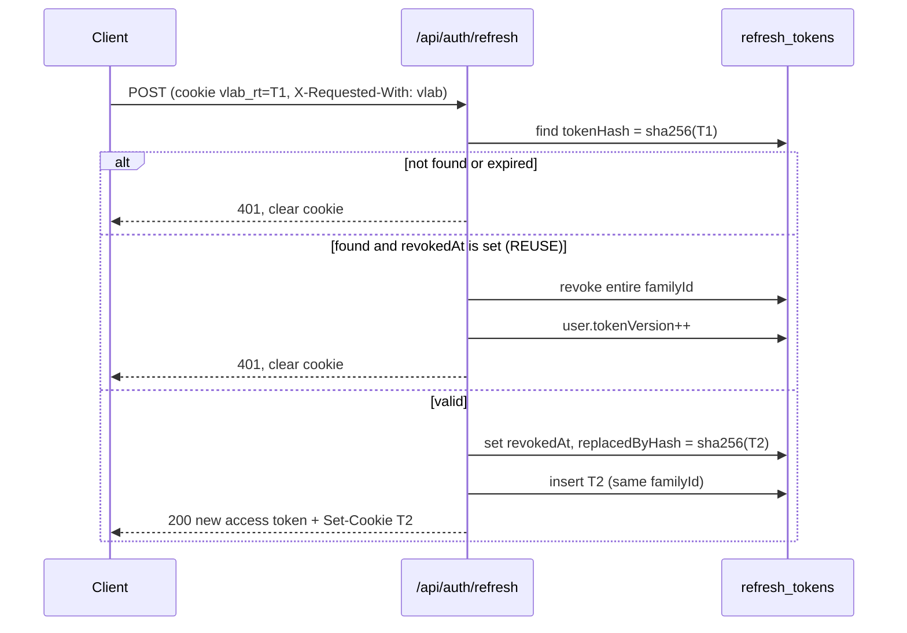

# V-Lab ECE: Security Architecture

Scope: authentication, token handling, CORS, HTTP headers, and server hardening. Python code-injection analysis is in `/docs/security/THREAT_MODEL.md` (Batch 4).

## 1. Security Goals

| ID   | Goal                                                                               |
| ---- | ---------------------------------------------------------------------------------- |
| SG-1 | Only authenticated, authorised users reach non-public APIs.                        |
| SG-2 | Stolen access tokens are short-lived; stolen refresh tokens are detected on reuse. |
| SG-3 | Student code can never reach the network, other users' data, or the server.        |
| SG-4 | Browser-side attack surface (XSS) is minimised by CSP and no third-party scripts.  |
| SG-5 | Student PII is minimised and access-controlled (`PRIVACY.md`).                     |

## 2. Token Model

| Token         | Format                                      | Lifetime                                         | Storage                                           | Transport                       |
| ------------- | ------------------------------------------- | ------------------------------------------------ | ------------------------------------------------- | ------------------------------- |
| Access token  | JWT, HS256 via `jose`                       | 15 minutes (`900 s`)                             | **JS memory only** (Zustand store, not persisted) | `Authorization: Bearer`         |
| Refresh token | Opaque 256-bit random (base64url, 43 chars) | 14 days sliding, absolute max 60 days per family | httpOnly cookie; server stores **SHA-256 hash**   | Cookie sent only to `/api/auth` |

### 2.1 Access token claims

```json
{
  "iss": "vlab-ece",
  "aud": "vlab-web",
  "sub": "<userId>",
  "role": "student",
  "tv": 3,
  "iat": 1790000000,
  "exp": 1790000900,
  "jti": "<uuid>"
}
```

Verification (`apps/api/src/middleware/authenticate.ts`):

1. Verify signature with `JWT_ACCESS_SECRET` (≥ 32 random bytes), algorithm allowlist `["HS256"]`, `iss`, `aud`, `exp` with 5 s clock tolerance.
2. Load user by `sub` (projection: `role`, `isActive`, `tokenVersion`, `sectionIds`); cache per request only.
3. Reject if `!isActive` (`403 E_ACCOUNT_DISABLED`) or `tv !== user.tokenVersion` (`401 E_UNAUTHENTICATED`).
4. Never trust the `role` claim for authorisation; use the DB `role` (the claim is informational for the client router).

```ts
// apps/api/src/services/tokens.ts
import { SignJWT, jwtVerify } from "jose";
const secret = new TextEncoder().encode(process.env.JWT_ACCESS_SECRET!);

export async function signAccessToken(u: { id: string; role: string; tokenVersion: number }) {
  return new SignJWT({ role: u.role, tv: u.tokenVersion })
    .setProtectedHeader({ alg: "HS256", typ: "JWT" })
    .setSubject(u.id)
    .setIssuer("vlab-ece")
    .setAudience("vlab-web")
    .setIssuedAt()
    .setExpirationTime("15m")
    .setJti(crypto.randomUUID())
    .sign(secret);
}

export async function verifyAccessToken(token: string) {
  return jwtVerify(token, secret, {
    algorithms: ["HS256"],
    issuer: "vlab-ece",
    audience: "vlab-web",
    clockTolerance: 5,
  });
}
```

### 2.2 Refresh cookie (AC-SEC-003)

```
Set-Cookie: vlab_rt=<token>; HttpOnly; Secure; SameSite=Strict; Path=/api/auth; Max-Age=1209600
```

- In local dev over HTTP, `Secure` is omitted only when `NODE_ENV === "development"`.
- Cookie name has no `__Host-` prefix because `Path` is restricted.

### 2.3 Rotation and reuse detection



Client behaviour: on any `401 E_UNAUTHENTICATED`, call refresh **once** (single-flight promise shared across concurrent requests), then replay the request once; failure redirects to `/login?next=...` after the IndexedDB draft is saved.

### 2.4 Logout and revocation

- `POST /api/auth/logout`: revoke the current family, clear the cookie.
- Password change, role change, deactivation: `tokenVersion++` (invalidates all access tokens within ≤ 15 min) and revoke all families.

## 3. Passwords and Account Protection

| Control      | Setting                                                                                                                                                       |
| ------------ | ------------------------------------------------------------------------------------------------------------------------------------------------------------- |
| Hash         | bcrypt cost 12 (`bcryptjs`)                                                                                                                                   |
| Policy       | ≥ 10 characters, ≤ 128; reject the top 10,000 common passwords (bundled list); no composition rules                                                           |
| Lockout      | 5 failures per email in 15 min → `lockedUntil = now + 15 min`; responses stay generic                                                                         |
| Timing       | Always run a bcrypt compare against a dummy hash when the user does not exist                                                                                 |
| Reset        | Token = 32 random bytes; store SHA-256 only; expires in 30 min; single use; invalidates all sessions                                                          |
| Enumeration  | `forgot` always returns `202`; login errors identical for unknown email and wrong password                                                                    |
| Email domain | Allowlist from env `ALLOWED_EMAIL_DOMAINS="iitism.ac.in,students.iitism.ac.in"` (suffix match with a leading `@`); admin-created users bypass the domain rule |

## 4. Authorisation (RBAC)

```ts
// apps/api/src/middleware/authorize.ts
export const authorize =
  (...roles: Role[]) =>
  (req, _res, next) => {
    if (!req.user) return next(new HttpError(401, "E_UNAUTHENTICATED"));
    if (!roles.includes(req.user.role)) return next(new HttpError(403, "E_FORBIDDEN"));
    next();
  };
```

- Mount: `/api/professor` → `authorize("professor")`; `/api/admin` → `authorize("admin")`; `/api/assignments` → `authorize("student")`.
- **Object-level checks** (IDOR prevention) happen in services: every query for owned resources includes `{ userId: req.user.id }` in the filter; non-matching → `404`.
- Admin cannot demote or deactivate themselves (prevents lock-out).

## 5. CORS Configuration

Production runs same-origin, so CORS is **deny by default**. Allowed origins exist for local development and Vercel preview deployments.

```ts
// apps/api/src/config/cors.ts
import cors from "cors";

const allowed = new Set(
  (process.env.CORS_ALLOWED_ORIGINS ?? "")
    .split(",")
    .map((s) => s.trim())
    .filter(Boolean),
); // e.g. "http://localhost:5173" in development; production value: ""

export const corsMiddleware = cors({
  origin(origin, cb) {
    if (!origin) return cb(null, false); // same-origin or non-browser: no CORS headers needed
    cb(null, allowed.has(origin)); // not allowed => no ACAO header (AC-SEC-004)
  },
  credentials: true,
  methods: ["GET", "POST", "PUT", "PATCH", "DELETE"],
  allowedHeaders: ["Authorization", "Content-Type", "If-Match", "X-Requested-With"],
  exposedHeaders: ["Retry-After", "X-Request-Id"],
  maxAge: 600,
});
```

- Never use `*`, never reflect arbitrary origins.
- Preview deployments: add the specific preview URL pattern through an exact-match env list (no wildcards).

## 6. CSRF

- State-changing cookie-authenticated endpoint is only `/api/auth/refresh` and `/api/auth/logout`. Defences, all required: `SameSite=Strict`; `Path=/api/auth`; require header `X-Requested-With: vlab` (not settable cross-origin without CORS preflight); verify `Origin` (if present) equals the app origin.
- All other endpoints use Bearer tokens (not auto-attached by browsers).

## 7. HTTP Security Headers (`vercel.json`)

```json
{
  "headers": [
    {
      "source": "/(.*)",
      "headers": [
        { "key": "Cross-Origin-Opener-Policy", "value": "same-origin" },
        { "key": "Cross-Origin-Embedder-Policy", "value": "require-corp" },
        { "key": "Cross-Origin-Resource-Policy", "value": "same-origin" },
        {
          "key": "Strict-Transport-Security",
          "value": "max-age=63072000; includeSubDomains; preload"
        },
        { "key": "X-Content-Type-Options", "value": "nosniff" },
        { "key": "Referrer-Policy", "value": "strict-origin-when-cross-origin" },
        {
          "key": "Permissions-Policy",
          "value": "camera=(), microphone=(), geolocation=(), payment=(), usb=(), serial=(), bluetooth=()"
        },
        { "key": "X-Frame-Options", "value": "DENY" },
        {
          "key": "Content-Security-Policy",
          "value": "default-src 'self'; script-src 'self' 'wasm-unsafe-eval'; style-src 'self' 'unsafe-inline'; img-src 'self' data: blob:; font-src 'self'; connect-src 'self'; worker-src 'self' blob:; manifest-src 'self'; object-src 'none'; base-uri 'none'; form-action 'self'; frame-ancestors 'none'; upgrade-insecure-requests"
        }
      ]
    },
    {
      "source": "/assets/workers/(.*)",
      "headers": [
        {
          "key": "Content-Security-Policy",
          "value": "default-src 'none'; script-src 'self' 'wasm-unsafe-eval' 'unsafe-eval'; connect-src 'self'; worker-src 'none'; img-src 'none'; style-src 'none'"
        },
        { "key": "Cross-Origin-Resource-Policy", "value": "same-origin" }
      ]
    },
    {
      "source": "/pyodide/(.*)",
      "headers": [{ "key": "Cache-Control", "value": "public, max-age=31536000, immutable" }]
    },
    {
      "source": "/api/(.*)",
      "headers": [{ "key": "Cache-Control", "value": "no-store" }]
    }
  ],
  "rewrites": [
    { "source": "/api/(.*)", "destination": "/api" },
    {
      "source": "/((?!api|pyodide|opencv|assets|sw\\.js|favicon\\.ico).*)",
      "destination": "/index.html"
    }
  ]
}
```

**Notes**

- `style-src 'unsafe-inline'` is required by Monaco and Plotly runtime styles. No `unsafe-inline` for scripts.
- `'unsafe-eval'` is granted **only** to the worker script response (`/assets/workers/*`), where Pyodide/Emscripten may need it. The Vite build must emit worker files under `assets/workers/` (`build.rollupOptions.output.entryFileNames` rule for worker chunks). If testing shows Pyodide 314.0.3 boots without `'unsafe-eval'`, **remove it** (least privilege) and record the result in `ARCHITECTURE_DECISIONS.md`.
- A worker's own `connect-src 'self'` limits network access from Python-reachable code, and the main document CSP also limits `connect-src` to `'self'` (AC-SEC-002).
- Final CSP must be validated by the Cypress test `csp.cy.ts`.

## 8. Input Handling

| Risk                                | Control                                                                                                                                                                                     |
| ----------------------------------- | ------------------------------------------------------------------------------------------------------------------------------------------------------------------------------------------- |
| Injection into Mongo                | Zod `.strict()`; reject keys beginning with `$` or containing `.` in user-supplied objects (`parameters`, `layout`) via a recursive key checker; use `mongoose.set("sanitizeFilter", true)` |
| Oversized bodies                    | `express.json({ limit: "300kb" })`; CSV `1mb` multipart limit                                                                                                                               |
| Markdown XSS (instructions, theory) | Render with `react-markdown` without `rehype-raw`; links get `rel="noopener noreferrer nofollow"` and only `http(s)` and `mailto` schemes                                                   |
| Prototype pollution                 | Reject `__proto__`, `constructor`, `prototype` keys in the recursive checker                                                                                                                |
| Log injection                       | `pino` structured logging; redact `authorization`, `cookie`, `password*`, `token*`                                                                                                          |

## 9. Secrets and Configuration

| Variable                      | Description                                            | Where                                       |
| ----------------------------- | ------------------------------------------------------ | ------------------------------------------- |
| `MONGODB_URI`                 | Atlas SRV string with least-privilege DB user          | Vercel env (Production, Preview separately) |
| `JWT_ACCESS_SECRET`           | ≥ 32 random bytes (base64)                             | Vercel env                                  |
| `REFRESH_TOKEN_PEPPER`        | Optional HMAC key mixed into SHA-256 of refresh tokens | Vercel env                                  |
| `ALLOWED_EMAIL_DOMAINS`       | Comma-separated                                        | Vercel env                                  |
| `CORS_ALLOWED_ORIGINS`        | Empty in production                                    | Vercel env                                  |
| `EMAIL_API_KEY`, `EMAIL_FROM` | Password reset mail                                    | Vercel env                                  |

Rules: no secrets in the repo or `VITE_*` variables (those are public); `.env.example` lists names only; rotate `JWT_ACCESS_SECRET` by supporting two secrets (`JWT_ACCESS_SECRET`, `JWT_ACCESS_SECRET_PREV`) during rotation.

## 10. Database Hardening

- Atlas DB user for the app: role `readWrite` on database `vlab` only; separate migration user for validators and indexes.
- `audit_logs`: insert/find only (custom role).
- Network access: Atlas IP allowlist cannot pin Vercel egress on free plans, so use `0.0.0.0/0` **only** together with a strong, unique DB password, TLS, and the least-privilege user; revisit when a static-egress option is available.
- Backups: Atlas M0 has no continuous backup; schedule a weekly `mongodump` through GitHub Actions to private storage (`DEPLOYMENT.md`).

## 11. Security Test Hooks (map to ACs)

| Test                                                                    | AC                                                |
| ----------------------------------------------------------------------- | ------------------------------------------------- |
| Student token against `/api/professor/*` and `/api/admin/*` returns 403 | AC-AUTH-004                                       |
| Sixth failed login returns 429 with `Retry-After`                       | AC-AUTH-005                                       |
| Refresh cookie flags exactly match                                      | AC-SEC-003                                        |
| Request with foreign `Origin` receives no `Access-Control-Allow-Origin` | AC-SEC-004                                        |
| CSP header present and equals the expected string                       | AC-SEC-002                                        |
| Reuse of a rotated refresh token revokes the family                     | new: AC-SEC-005 (add to `ACCEPTANCE_CRITERIA.md`) |
