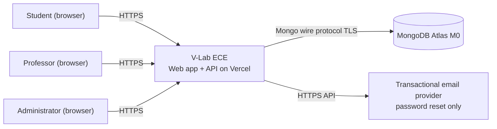
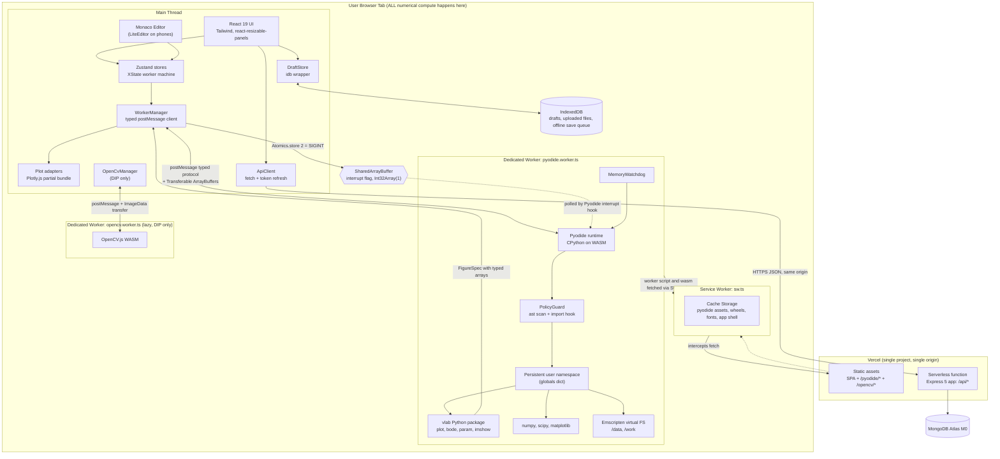
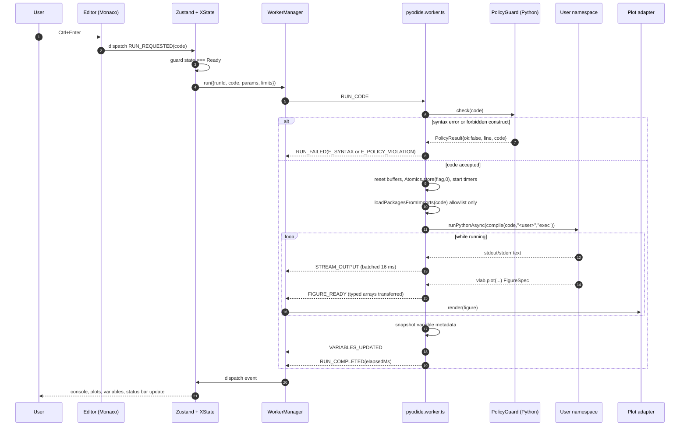
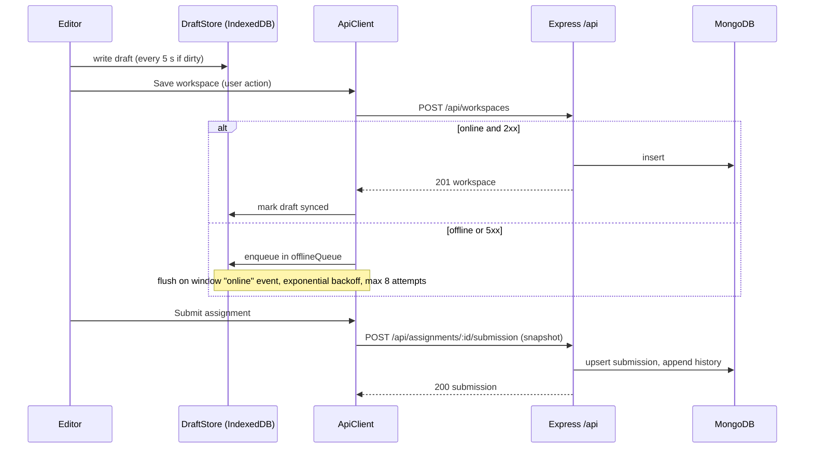
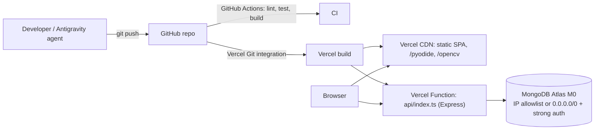

# V-Lab ECE: System Architecture

> **Agent instruction:** This file is the source of truth for component boundaries, the worker message protocol, and data flow. The TypeScript in Section 6 is normative and must be copied verbatim into `packages/shared/src/protocol.ts`.

## 1. Architectural Principles

1. **Compute in the browser, state on the server.** The API never evaluates student code (AC-ASG-004).
2. **One heavy runtime per tab, isolated in a Web Worker.** The main thread never imports Pyodide (FR-ENG-01).
3. **Same-origin everything.** Web app, API, and Pyodide assets share one origin, which simplifies cookies, CSP, and cross-origin isolation.
4. **Typed contracts at every boundary.** Worker protocol, REST, and Mongo documents are validated with the same Zod schemas from `packages/shared`.
5. **Fail soft.** Any worker failure ends in a respawn, never a dead tab.

## 2. System Context (C4 Level 1)



## 3. Container Diagram (C4 Level 2), Including the Web Worker Pyodide Architecture



**Key properties**
| Property | Mechanism |
|---|---|
| UI never freezes | Pyodide only in `pyodide.worker.ts` |
| Cancel in place | `pyodide.setInterruptBuffer(sab)`; main writes `2` with `Atomics.store` |
| Cancel fallback | `worker.terminate()` + respawn when `crossOriginIsolated === false` or grace expires |
| No exfiltration | Worker CSP `connect-src 'self'`; `js`/`pyodide.ffi` imports blocked by PolicyGuard |
| Offline after first load | Service Worker caches versioned runtime files |
| Heavy data stays in the browser | Plot data never goes to the server; only code, params, and layout are saved |

## 4. Run Sequence (Main Thread, Worker, Plot Panel)



## 5. Save, Submit, and Offline Queue



## 6. Worker Protocol (Normative TypeScript)

```ts
// packages/shared/src/protocol.ts
import { z } from "zod";

export type RunId = string; // UUID v4
export type RequestId = string; // UUID v4

export type EngineStage = "runtime" | "packages" | "bootstrap";

export interface EngineConfig {
  pyodideBaseUrl: string; // "/pyodide/314.0.3/" (versioned, same origin)
  preloadPackages: string[]; // ["numpy","scipy"]
  lazyPackages: string[]; // ["matplotlib"]
  limits: RunLimits;
  interruptBuffer: SharedArrayBuffer | null; // null when not cross-origin isolated
  deviceProfile: "desktop" | "tablet" | "phone";
}

export interface RunLimits {
  timeoutMs: number; // default 30000, max 120000
  maxArrayElements: number; // 20_000_000
  maxWorkerHeapMb: number; // 1200 desktop, 800 tablet, 600 phone
  maxStdoutBytes: number; // 2_097_152
}

export type ParamValue = number | string | boolean;

export interface ParamDecl {
  name: string;
  default: ParamValue;
  min?: number;
  max?: number;
  step?: number;
  label?: string;
  kind: "slider" | "number" | "select" | "toggle";
  options?: string[];
}

export interface VariableInfo {
  name: string;
  type: string; // "ndarray","float","int","complex","list","str"
  shape: number[] | null;
  dtype: string | null;
  preview: string; // <= 120 chars
  sizeBytes: number | null;
}

export type ErrorCode =
  | "E_SYNTAX"
  | "E_RUNTIME"
  | "E_POLICY_VIOLATION"
  | "E_PACKAGE_LOAD"
  | "E_LIMIT_TIMEOUT"
  | "E_LIMIT_ARRAY"
  | "E_LIMIT_STDOUT"
  | "E_LIMIT_MEMORY"
  | "E_CANCELLED"
  | "E_ENGINE_BOOT"
  | "E_FS"
  | "E_INTERNAL";

export interface PyError {
  code: ErrorCode;
  name: string;
  message: string;
  line: number | null;
  column: number | null;
  traceback: string; // user frames only
}

// ---------- Figures ----------
export type FigureKind =
  | "cartesian"
  | "stem"
  | "bode"
  | "pzmap"
  | "heatmap"
  | "image"
  | "surface3d"
  | "scatter3d"
  | "constellation"
  | "eye"
  | "raster";

export interface TraceData {
  type:
    | "scatter"
    | "scattergl"
    | "bar"
    | "heatmap"
    | "image"
    | "surface"
    | "scatter3d"
    | "histogram";
  name?: string;
  x?: Float64Array;
  y?: Float64Array;
  z?: Float64Array;
  zMatrix?: { data: Float64Array; rows: number; cols: number };
  imageRgba?: { data: Uint8ClampedArray; width: number; height: number };
  mode?: "lines" | "markers" | "lines+markers" | "stem";
  xAxis?: "x" | "x2";
  yAxis?: "y" | "y2";
  style?: {
    color?: string;
    width?: number;
    dash?: "solid" | "dash" | "dot";
    markerSize?: number;
    opacity?: number;
  };
}

export interface FigureLayout {
  title?: string;
  xLabel?: string;
  yLabel?: string;
  xScale?: "linear" | "log";
  yScale?: "linear" | "log";
  xRange?: [number, number];
  yRange?: [number, number];
  grid?: boolean;
  legend?: boolean;
  subplots?: { rows: number; cols: number; shareX?: boolean };
  aspect?: "auto" | "equal";
  shapes?: Array<{
    type: "circle" | "line" | "vline" | "hline";
    x0?: number;
    y0?: number;
    x1?: number;
    y1?: number;
    r?: number;
  }>;
}

export interface FigureSpec {
  id: string; // stable id; same id replaces existing figure
  kind: FigureKind;
  layout: FigureLayout;
  traces: TraceData[];
  raster?: { mime: "image/png" | "image/svg+xml"; data: ArrayBuffer }; // matplotlib compat
}

// ---------- Main -> Worker ----------
export type MainToWorker =
  | { type: "INIT"; config: EngineConfig }
  | {
      type: "RUN_CODE";
      runId: RunId;
      code: string;
      filename: "<user>";
      selection: boolean;
      params: Record<string, ParamValue>;
      limits: RunLimits;
    }
  | { type: "FS_WRITE"; requestId: RequestId; path: string; data: ArrayBuffer }
  | { type: "FS_READ"; requestId: RequestId; path: string }
  | { type: "FS_LIST"; requestId: RequestId; dir: string }
  | { type: "FS_DELETE"; requestId: RequestId; path: string }
  | { type: "INSPECT_VARIABLE"; requestId: RequestId; name: string; maxRows: number }
  | { type: "PING"; sentAt: number };

// ---------- Worker -> Main ----------
export type WorkerToMain =
  | { type: "ENGINE_PROGRESS"; stage: EngineStage; percent: number; message: string }
  | {
      type: "ENGINE_READY";
      pyodideVersion: string;
      pythonVersion: string;
      packages: Record<string, string>;
    }
  | { type: "ENGINE_ERROR"; error: PyError }
  | { type: "STREAM_OUTPUT"; runId: RunId; stream: "stdout" | "stderr"; text: string }
  | { type: "PARAM_DECLARED"; runId: RunId; param: ParamDecl }
  | { type: "FIGURE_READY"; runId: RunId; figure: FigureSpec }
  | { type: "VARIABLES_UPDATED"; runId: RunId; variables: VariableInfo[] }
  | { type: "RUN_COMPLETED"; runId: RunId; elapsedMs: number }
  | { type: "RUN_FAILED"; runId: RunId; error: PyError; elapsedMs: number }
  | { type: "RUN_CANCELLED"; runId: RunId; elapsedMs: number }
  | {
      type: "FS_RESULT";
      requestId: RequestId;
      ok: boolean;
      data?: ArrayBuffer | string[];
      error?: string;
    }
  | { type: "VARIABLE_DETAIL"; requestId: RequestId; rows: unknown[][]; columns: string[] }
  | { type: "MEMORY_STATS"; heapMb: number }
  | { type: "PONG"; sentAt: number };

// Runtime validators (reject unknown types: AC-ENG-008)
export const mainToWorkerSchema: z.ZodType<MainToWorker> = z.lazy(() =>
  /* discriminatedUnion("type", [...]) generated for every variant above */ z.any(),
);
```

> **Agent note:** Replace the `z.lazy(... z.any())` placeholder above with a full `z.discriminatedUnion("type", [...])` covering **every** variant. `any` is forbidden outside this single scaffold line and must be removed before M1 completes (tracked as task T-017 in `IMPLEMENTATION_PLAN.md`).

### 6.1 Protocol Rules

- All `Float64Array`/`Uint8ClampedArray`/`ArrayBuffer` payloads are sent with the **transfer list** (zero-copy).
- Every run message carries `runId`; the UI discards messages with a stale `runId`.
- `STREAM_OUTPUT` is batched in the worker on a 16 ms timer (max about 60 messages/s).
- The worker validates `RUN_CODE` limits and refuses values above the hard maxima in `packages/shared/src/limits.ts`.

## 7. The `vlab` Python Package (injected at bootstrap)

Location in repo: `packages/vlab-py/vlab/`. Installed into Pyodide's FS at `/lib/vlab` and added to `sys.path`.

| Function       | Signature                                                                                                                        | Behaviour                                                                                       |
| -------------- | -------------------------------------------------------------------------------------------------------------------------------- | ----------------------------------------------------------------------------------------------- |
| `vlab.plot`    | `plot(x, y=None, *, label=None, fig="fig1", title=None, xlabel=None, ylabel=None, xscale="linear", yscale="linear", style=None)` | Adds or replaces a line trace; builds `FigureSpec`                                              |
| `vlab.stem`    | `stem(x, y, *, label=None, fig="fig1", ...)`                                                                                     | Discrete-time stem trace                                                                        |
| `vlab.bode`    | `bode(num, den, *, system="s", w=None, fs=None, fig="bode")`                                                                     | Two linked subplots, magnitude dB and phase deg, log frequency                                  |
| `vlab.pzmap`   | `pzmap(z, p, *, domain="z", fig="pz")`                                                                                           | Poles and zeros; unit circle shape for `z` domain                                               |
| `vlab.imshow`  | `imshow(arr, *, cmap="gray", fig="img", vmin=None, vmax=None)`                                                                   | Image trace with pixel inspector data                                                           |
| `vlab.heatmap` | `heatmap(Z, x=None, y=None, *, fig="hm", colorscale="Viridis")`                                                                  | Spectrogram or matrix                                                                           |
| `vlab.scatter` | `scatter(x, y, *, fig="const", ...)`                                                                                             | Constellation diagrams                                                                          |
| `vlab.eye`     | `eye(signal, sps, *, span=2, fig="eye")`                                                                                         | Eye diagram (overlay of folded traces)                                                          |
| `vlab.surface` | `surface(X, Y, Z, *, fig="surf")`                                                                                                | 3D surface                                                                                      |
| `vlab.param`   | `param(name, default, min=None, max=None, step=None, *, label=None)`                                                             | Declares a UI control; returns the **current UI value** (from `RUN_CODE.params`) or the default |
| `vlab.seed`    | `seed(default=0)`                                                                                                                | Returns `np.random.default_rng(param("seed", default))`                                         |
| `vlab.show`    | `show()`                                                                                                                         | Flushes pending figures (called automatically at end of run)                                    |
| `vlab.table`   | `table(rows, columns, *, title=None)`                                                                                            | Result table in console panel                                                                   |

**Rules**

- `vlab.*` calls produce `FigureSpec` dicts; the worker converts NumPy arrays to JS typed arrays using `to_js` and transfers buffers.
- Arrays above `MAX_ARRAY_ELEMENTS` raise `VlabLimitError` mapped to `E_LIMIT_ARRAY`.
- `matplotlib` is configured with the non-interactive `Agg` backend. The worker overrides `plt.show()` to render the current figure to PNG (dpi 110) and emits `FIGURE_READY` with `kind: "raster"`.

## 8. PolicyGuard (worker-side safety layer)

Executed **inside the worker** (Python `ast` module), before any user code runs:

1. `ast.parse(code, filename="<user>")` → on `SyntaxError`, return `E_SYNTAX` with line and column.
2. Walk AST. Reject (`E_POLICY_VIOLATION`):
   - `import`/`from ... import` of: `js`, `pyodide`, `pyodide_js`, `pyodide.ffi`, `micropip`, `subprocess`, `socket`, `ctypes`, `os` attributes `system|popen|spawn*|exec*|fork`, `sys.modules` mutation, `importlib` (all), `builtins` assignment, `ssl`, `http`, `urllib`, `requests`, `webbrowser`.
   - Access to dunder escape paths: `__import__`, `__builtins__` writes, `__subclasses__`, `__globals__`, `__loader__`, `__spec__` on modules.
   - `eval`, `exec`, `compile` with non-literal arguments are allowed **only** inside `vlab` internals; user calls are rejected.
3. Install a `sys.meta_path` finder at bootstrap that raises `ImportError` for the same module names (defence in depth: covers dynamic import strings that evade static analysis).
4. Remove `js`/`pyodide_js` modules from `sys.modules` after bootstrap, and delete the global `js` reference from `globalThis` inside the worker where the platform does not need it (the worker keeps its own closure reference).

Full threat analysis: `/docs/security/THREAT_MODEL.md` (Batch 4).

## 9. Cross-Origin Isolation

Required for `SharedArrayBuffer`.
| Header (on every HTML, JS, worker response from the app origin) | Value |
|---|---|
| `Cross-Origin-Opener-Policy` | `same-origin` |
| `Cross-Origin-Embedder-Policy` | `require-corp` |
| `Cross-Origin-Resource-Policy` | `same-origin` |

Consequences: no third-party iframes, images, or scripts without CORP/CORS. Fonts, Pyodide, OpenCV.js, KaTeX CSS/fonts are all **self-hosted**.
At boot: `const isolated = self.crossOriginIsolated && typeof SharedArrayBuffer !== "undefined"`. If false, set `interruptBuffer: null` and use the terminate path.

## 10. Caching Strategy

| Asset                                                       | Strategy                                             | Cache name                   |
| ----------------------------------------------------------- | ---------------------------------------------------- | ---------------------------- |
| App shell (HTML)                                            | Network-first, fallback to cache                     | `vlab-shell-v{APP_VERSION}`  |
| Hashed JS/CSS                                               | Cache-first, immutable                               | `vlab-assets-v{APP_VERSION}` |
| `/pyodide/314.0.3/*` (runtime, `pyodide-lock.json`, wheels) | Cache-first, immutable; pre-warm after first `Ready` | `vlab-pyodide-314.0.3`       |
| `/opencv/*`                                                 | Cache-first, fetched only on first DIP workspace     | `vlab-opencv-v{N}`           |
| `/api/*`                                                    | Never cached by SW                                   | none                         |

Eviction: on `activate`, delete caches whose names are not in the current allowlist.

## 11. Deployment View



Single Vercel project; `vercel.json` sets headers and the `/api/(.*)` rewrite. Details: `/docs/production/DEPLOYMENT.md` (Batch 4).

## 12. Monorepo Layout

```
v-lab-ece/
├── apps/
│   ├── web/                      # Vite + React + TS SPA
│   │   ├── public/pyodide/314.0.3/   # copied at build from npm "pyodide" package
│   │   ├── public/opencv/
│   │   ├── src/
│   │   │   ├── app/              # router, providers
│   │   │   ├── features/         # auth, catalog, workspace, assignments, professor, admin
│   │   │   ├── engine/           # WorkerManager, worker/pyodide.worker.ts, worker/opencv.worker.ts
│   │   │   ├── plots/            # Plotly adapters
│   │   │   ├── state/            # zustand stores, xstate machines
│   │   │   ├── lib/              # api client, idb, utils
│   │   │   └── sw/               # service worker
│   │   └── index.html
│   └── api/                      # Express 5 + Mongoose
│       └── src/ { app.ts, routes/, models/, middleware/, services/, config/ }
├── api/index.ts                  # Vercel function entry (imports apps/api/src/app)
├── packages/
│   ├── shared/                   # Zod schemas, protocol.ts, limits.ts, error codes
│   ├── experiments/              # *.experiment.json, golden/*.npy, schema
│   └── vlab-py/                  # vlab Python package
├── docs/
├── vercel.json  turbo.json  pnpm-workspace.yaml  package.json  tsconfig.base.json
```

## 13. Scalability and Limits

| Concern                       | Design response                                                                                          |
| ----------------------------- | -------------------------------------------------------------------------------------------------------- |
| 1,000 users                   | All compute is local; API traffic is small JSON; M0 (512 MB) is sufficient: about 50 KB average per user |
| Atlas M0 connection limit     | Cache the Mongoose connection across invocations (`global._mongoose`); `maxPoolSize: 5`                  |
| Cold starts of serverless API | Keep dependencies lean; no heavy imports at module scope                                                 |
| Vercel function body limit    | Workspace payload ≤ 200 KB, import CSV ≤ 1 MB                                                            |
