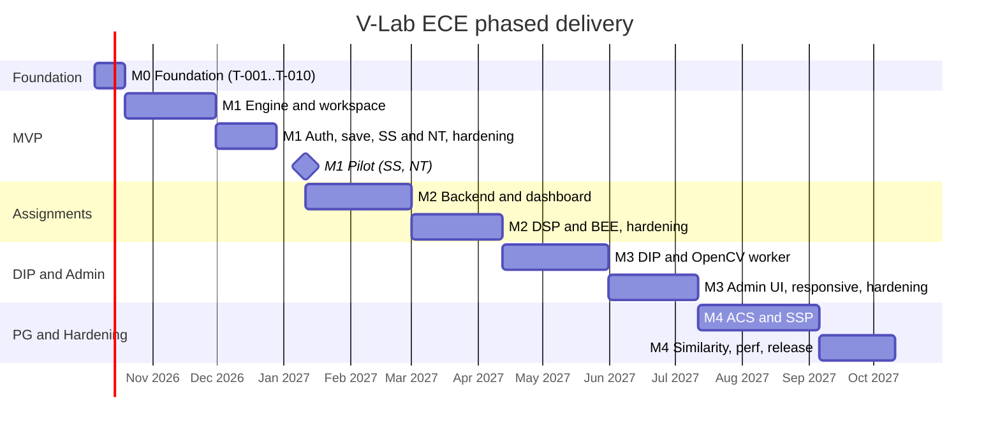

# V-Lab ECE: Milestones and Phased Rollout

Calendar assumptions (confirm with the department): kickoff the week of **5 Oct 2026**; the first pilot cohort uses the lab at the start of the **spring semester (January 2027)**. Month targets match the horizons in `PRODUCT_VISION.md` §8. Task IDs refer to `IMPLEMENTATION_PLAN.md`.

## 1. Timeline Overview



Dates are planning targets, not commitments; the **exit criteria** below gate each milestone, not the calendar.

## 2. Milestone M0: Foundation (about 2 weeks)

| Item          | Detail                                                                                                                                                                                        |
| ------------- | --------------------------------------------------------------------------------------------------------------------------------------------------------------------------------------------- |
| Tasks         | T-001 to T-010                                                                                                                                                                                |
| Outcome       | Monorepo builds, lints, tests, and deploys an empty SPA and `/api/health` to a Vercel preview with the required security headers                                                              |
| Exit criteria | `pnpm verify` green in CI; preview URL returns the COOP/COEP/CSP headers (AC-SEC-002 header test); `/pyodide/314.0.3/` assets served with immutable caching; `ENGINE_VERSIONS.json` committed |
| Not included  | Any user feature                                                                                                                                                                              |

## 3. Milestone M1: MVP (by month 3; first pilot)

| Item        | Detail                                                                                                                                                                                        |
| ----------- | --------------------------------------------------------------------------------------------------------------------------------------------------------------------------------------------- |
| Tasks       | T-011 to T-057                                                                                                                                                                                |
| Experiments | SS-01..07, NT-01..07 (14)                                                                                                                                                                     |
| Users       | Students (all), Admin (seed script), Guests                                                                                                                                                   |
| Features    | Workspace (editor, console, plots, variables, parameters, explorer, uploads, export), engine with cancel/timeout, offline drafts, auth, saved workspaces, catalogue, theory, engine telemetry |
| Deferred    | Assignments, professor dashboard, DIP, PG, phone-optimised layout (phones get the desktop layout's tablet fallback only if width ≥ 768; otherwise a "use a larger screen" notice)             |

**Exit criteria (all required)**

1. All ACs for: AUTH 001-006, CAT 001-003, WS 001-007 and 009-010, ENG 001-011, PLT 001-007, NUM (for SS and NT experiments) 001-013, SAVE 001-004, SEC 001-005, UI 001-003 and 005, PERF 001-004.
2. Cold start p75 ≤ 20 s and warm start p75 ≤ 5 s measured on 5 real devices (QA_CHECKLIST §3).
3. Zero open Sev-1 or Sev-2 bugs.
4. `PILOT.md` runbook rehearsed: create admin, seed courses, import 20 test students.

**Pilot (M1)**
| Parameter | Value |
|---|---|
| Cohort | 1 to 2 lab sections of SS and NT (about 20 to 40 students) + 2 faculty/TAs observing |
| Duration | 3 weeks of normal lab work |
| Feedback | In-app survey after week 1 and 3 (5-point scale + free text); weekly 20-minute faculty sync |
| Success | Run success ≥ 98 %, engine crash rate ≤ 1 %, satisfaction ≥ 3.8, no data-loss reports |
| Rollback | Faculty can revert to lab PCs at any time; app is additive. Feature flags in §8 disable risky features remotely |

## 4. Milestone M2: Assignments and Professor Tools (by month 6)

| Item          | Detail                                                                                                                                                                                                                                                                                                |
| ------------- | ----------------------------------------------------------------------------------------------------------------------------------------------------------------------------------------------------------------------------------------------------------------------------------------------------- |
| Tasks         | T-058 to T-070                                                                                                                                                                                                                                                                                        |
| Experiments   | DSP-01..07, BEE-01..07 (cumulative 28)                                                                                                                                                                                                                                                                |
| Users         | Professors added                                                                                                                                                                                                                                                                                      |
| Features      | Admin API (users, courses, sections, audit), assignments, submissions, grading, analytics, CSV, review workspace, settings                                                                                                                                                                            |
| Exit criteria | ACs: ASG 001-007, PROF 001-003, ADM 001-005, AUTH 004 (role matrix), NUM for DSP and BEE, plus M1 regression; performance specs for FFT/convolution budgets pass (TEST_PLAN); one full assignment cycle executed by pilot faculty: create → students submit → professor re-runs → grades → CSV export |
| Pilot         | 2 courses, 3 assignments, ≥ 60 students; success: on-time submission ≥ 85 %, grading-time reduction reported ≥ 30 % (faculty survey)                                                                                                                                                                  |

## 5. Milestone M3: Digital Image Processing, Admin UI, Responsive (by month 9)

| Item          | Detail                                                                                                                                                    |
| ------------- | --------------------------------------------------------------------------------------------------------------------------------------------------------- |
| Tasks         | T-071 to T-077                                                                                                                                            |
| Experiments   | DIP-01..07 (cumulative 35)                                                                                                                                |
| Features      | OpenCV.js worker, image viewer and pixel inspector, Admin UI, usage stats, user erase, tablet and phone layouts, fullscreen figures                       |
| Exit criteria | ACs: DIP 001-005, ADM 006-008, UI 001-005 across the viewport matrix, PERF with DIP images at the pixel cap; ADR-009 review completed (decision recorded) |
| Rollout       | Enabled for the DIP course only; other courses unaffected (experiment toggles)                                                                            |

## 6. Milestone M4: Postgraduate Modules, Similarity, Hardening (by month 12)

| Item          | Detail                                                                                                                                                                                               |
| ------------- | ---------------------------------------------------------------------------------------------------------------------------------------------------------------------------------------------------- |
| Tasks         | T-078 to T-085                                                                                                                                                                                       |
| Experiments   | ACS-01..08, SSP-01..08 (cumulative 51)                                                                                                                                                               |
| Features      | Monte Carlo experiments with profile caps, similarity hints, MATLAB-to-NumPy cheat sheets, optional version history, performance hardening                                                           |
| Exit criteria | All ACs in `ACCEPTANCE_CRITERIA.md` pass in CI; security checklist signed off (Batch 4); full regression across Chrome, Edge, Firefox, Safari; 2 PG cohorts run ACS/SSP labs; handover docs complete |
| Release       | v1.0.0 tag; announcement to department; operations runbook handed to department IT                                                                                                                   |

## 7. Story-to-Release Mapping (supersedes `USER_STORIES.md` §5)

| Release | Stories                                                                                                                          |
| ------- | -------------------------------------------------------------------------------------------------------------------------------- |
| M1      | US-S-001 to 015, 017 to 020, 024, 027; US-A-001 (seed/admin API minimal), US-A-002, US-A-004 (seed script only); US-T-001 to 005 |
| M2      | US-S-021 to 023, 025; US-P-001 to 009, 011, 012; US-A-001, 002, 004 (full API)                                                   |
| M3      | US-S-016, 026; US-A-003, 005 to 008                                                                                              |
| M4      | US-S-028; US-P-010                                                                                                               |

Changes from the Batch 1 mapping: US-S-012 (variable inspector) and US-S-013 (parameter sliders) move to M1 because experiments depend on them; US-A-004 minimal form lands in M1 via the seed script.

## 8. Feature Flags and Rollout Controls

| Flag                       | Mechanism                                                       | Default             | Purpose                                          |
| -------------------------- | --------------------------------------------------------------- | ------------------- | ------------------------------------------------ |
| `experiment.<id>.enabled`  | `experiment_settings` collection (admin toggle)                 | per `releaseStatus` | Enable per experiment without deploy             |
| `FEATURE_ASSIGNMENTS`      | Build-time env (`VITE_FEATURE_ASSIGNMENTS`) mirrored in API env | off until M2        | Hide assignments in M1 builds                    |
| `FEATURE_DIP`              | Build-time                                                      | off until M3        | Hide DIP and OpenCV assets                       |
| `FEATURE_PG`               | Build-time                                                      | off until M4        | Hide ACS and SSP                                 |
| `FEATURE_LIVE_RUN_DEFAULT` | User preference                                                 | off                 | Live parameter re-run                            |
| `ENGINE_KILL_SWITCH`       | `GET /api/catalog/settings` returns `engineBlocked: true`       | false               | Emergency: show maintenance banner and block Run |

(Add the `engineBlocked` field to API_SPEC §3 response when implementing T-046.)

## 9. Go/No-Go Gate Template (per milestone)

```
Milestone: M_
Date:
[ ] All exit-criteria ACs green in CI (link to run)
[ ] QA_CHECKLIST sections 1-9 completed on required devices (link)
[ ] No open Sev-1/Sev-2 bugs
[ ] Security checklist items for this milestone complete
[ ] Rollback plan verified (flags, previous deployment promoted in Vercel)
[ ] Faculty sponsor sign-off:
[ ] Decision: GO / NO-GO / GO WITH CONDITIONS
```

## 10. Bug Severity Definitions

| Sev | Definition                                                               | Response                                        |
| --- | ------------------------------------------------------------------------ | ----------------------------------------------- |
| 1   | Data loss, security issue, engine unusable for everyone                  | Immediate; hotfix within 24 h; flag/kill switch |
| 2   | Core flow broken for a subset (cannot submit, cannot run on one browser) | Fix within 3 working days                       |
| 3   | Incorrect result in one experiment, UI defect with workaround            | Next release                                    |
| 4   | Cosmetic                                                                 | Backlog                                         |

A numerical error in an experiment (golden mismatch) is **Sev 2** because grading depends on it.

## 11. Risk Watchlist per Milestone

| Milestone | Top risk                                | Mitigation                                                     |
| --------- | --------------------------------------- | -------------------------------------------------------------- |
| M0        | COEP breaks an asset load               | Header test in CI; all assets self-hosted                      |
| M1        | Cold-start too slow on campus Wi-Fi     | Pre-warm, SW cache, optional LAN mirror; measure early (T-023) |
| M1        | Cancel semantics confuse students       | Clear UI copy; documented kernel reset                         |
| M2        | Faculty distrust of client-side results | ADR-013 re-run flow demonstrated early in pilot                |
| M3        | OpenCV.js size and memory               | Lazy load, pixel caps, ADR-009 review                          |
| M4        | Monte Carlo performance on tablets      | Profile caps with notices                                      |
