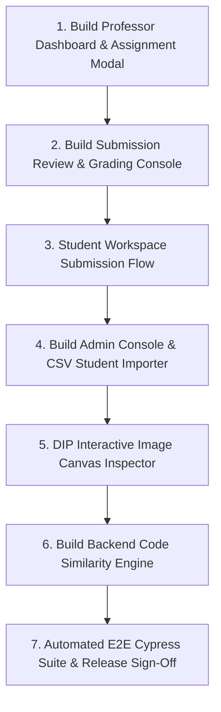

# V-Lab ECE: Final Project Completion Roadmap

**Document Version:** 1.0.0  
**Current Milestone Completed:** Core Engineering & Phases 1–5 (CPython/Pyodide Engine, 51-Experiment ECE Catalog, Web Worker Architecture, Workspace Shell & Plotly/SVG Rendering)  
**Target:** Full Academic Production Release (Milestones M2, M3, M4)

---

## Executive Summary

The core technical foundation of **V-Lab ECE** (CPython 3.12 WebAssembly engine, 51 curriculum experiments across 7 ECE courses, numerical validation suite, authentication and workspace persistence backend) is **100% complete and passing all verification gates**.

To transition the project from a core simulation sandbox to a complete, full-featured institutional virtual laboratory platform, the remaining work is divided into **3 sequential execution stages** matching [`docs/development/MILESTONES.md`](./MILESTONES.md).

```
                      CURRENT STATE (Phases 1-5 Complete)
                                    │
                                    ▼
┌────────────────────────────────────────────────────────────────────────┐
│ STEP 1: Milestone 2 (M2) ─ Professor Tools & Grading Workflow          │
│ • Professor Dashboard & Assignment Management                          │
│ • Assignment Creation Modal (linked to 51 experiments)                 │
│ • Student Submission Flow in Workspace                                 │
│ • Side-by-Side Code Review & Rubric Grading Interface                 │
│ • CSV Gradebook Export                                                 │
└───────────────────────────────────┬────────────────────────────────────┘
                                    │
                                    ▼
┌────────────────────────────────────────────────────────────────────────┐
│ STEP 2: Milestone 3 (M3) ─ Admin Console, User Mgmt & Advanced CV     │
│ • Admin System Health & Audit Log Dashboard                            │
│ • Bulk Student CSV Batch Importer & Section Enrollment                 │
│ • Role-Based Access Control (RBAC) Management Table                    │
│ • DIP (Digital Image Processing) Interactive Canvas & Pixel Inspector   │
└───────────────────────────────────┬────────────────────────────────────┘
                                    │
                                    ▼
┌────────────────────────────────────────────────────────────────────────┐
│ STEP 3: Milestone 4 (M4) ─ Plagiarism Detection & Production Release  │
│ • Backend AST Normalization & Winnowing Code Similarity Engine         │
│ • Pairwise Plagiarism Matrix & Flagging in Grading Interface           │
│ • End-to-End Cypress User Journey & Smoke Test Automation              │
│ • Final Production Build & Performance Benchmarking                    │
└────────────────────────────────────────────────────────────────────────┘
```

---

## STEP 1: Milestone 2 (M2) — Professor Tools & Grading Workflow

**Objective:** Enable professors to create assignments, monitor student submissions, review submitted Python code and figures, assign grades with rubrics, and export CSV gradebooks.

### Tasks to Implement:

1. **Professor Dashboard Main View (`apps/web/src/pages/ProfessorDashboard.tsx`)**
   - Active courses selector (`SS`, `NT`, `DSP`, `DIP`, `BEE`, `ACS`, `SSP`).
   - Summary statistics cards: *Active Assignments*, *Pending Submissions*, *Graded Count*, *Average Course Score*.
   - Tabular view of all created assignments with quick actions (*Edit*, *Submissions*, *Export CSV*, *Close Assignment*).

2. **Assignment Builder Modal (`apps/web/src/components/professor/AssignmentEditorModal.tsx`)**
   - Link assignment to any of the 51 validated experiments in the catalog.
   - Configure custom starter code instructions, parameter ranges, allowed execution limits, deadline timestamp, and maximum points.
   - Connect to `POST /api/v1/professor/assignments` and `PUT /api/v1/professor/assignments/:id`.

3. **Student Assignment Submission Modal in Workspace (`apps/web/src/components/workspace/SubmitAssignmentModal.tsx`)**
   - Direct "Submit for Grading" button in the Workspace top bar when working on an assigned lab.
   - Snapshot code, current parameters, console outputs, and generated figures.
   - Connect to `POST /api/v1/assignments/:id/submit`.

4. **Side-by-Side Submission Review & Grading Console (`apps/web/src/pages/SubmissionReview.tsx`)**
   - Student roster table with submission timestamps, late status indicator, and grading status.
   - Split review workspace: Student code (Monaco read-only), execution output & plots on the left; rubric scoring and text feedback form on the right.
   - Connect to `POST /api/v1/professor/submissions/:id/grade`.
   - One-click CSV gradebook export connecting to `GET /api/v1/professor/assignments/:id/export-csv`.

---

## STEP 2: Milestone 3 (M3) — Admin Management & Advanced CV Tools

**Objective:** Enable institutional administrators to manage users, import entire class rosters via CSV, monitor audit logs, and provide dedicated visual inspection tools for Digital Image Processing.

### Tasks to Implement:

1. **Admin Dashboard Overview (`apps/web/src/pages/AdminDashboard.tsx`)**
   - High-level system vitals: Total registered students, faculty accounts, active workspaces saved, and storage utilization.
   - Security Audit Log viewer showing login events, role modifications, and admin actions.

2. **Bulk Student CSV Roster Importer (`apps/web/src/components/admin/CsvImportModal.tsx`)**
   - Drag-and-drop CSV upload with schema validation (`email`, `fullName`, `rollNumber`, `courseCode`, `section`).
   - Client-side preview with error row highlighting before database commit.
   - Backend batch processor with automatic account creation and course section enrollment.

3. **User & Role Management Table (`apps/web/src/components/admin/UserManagementTable.tsx`)**
   - Searchable, paginated user list with role filters (`student`, `professor`, `admin`).
   - Actions to promote/demote user roles, reset passwords, or suspend compromised accounts.

4. **Digital Image Processing (DIP) Interactive Inspector (`apps/web/src/components/workspace/ImageInspector.tsx`)**
   - 2D Canvas viewer for image matrix outputs (`vlab.imshow`).
   - Interactive pixel value hover tooltip $(R, G, B / \text{Intensity})$, zoom/pan controls, and histogram equalizer view.

---

## STEP 3: Milestone 4 (M4) — Plagiarism Detection & Production Hardening

**Objective:** Protect academic integrity through code similarity analysis, execute complete end-to-end regression suites, and produce the final production deployment bundle.

### Tasks to Implement:

1. **Code Similarity & Plagiarism Service (`apps/api/src/services/similarity.service.ts`)**
   - **AST Normalization:** Strip comments, normalize variable/function names, and remove formatting variances.
   - **Winnowing Algorithm:** Generate $k$-gram fingerprint hashes of submitted Python scripts.
   - **Jaccard Similarity Matrix:** Compute pairwise similarity scores across all submissions for an assignment.
   - Flag submissions exceeding an 80% similarity threshold with highlighted matching token blocks on the professor grading interface.

2. **End-to-End Cypress Integration Suite (`cypress/e2e/`)**
   - Automated testing of complete user journeys:
     - `auth.cy.ts`: Registration $\rightarrow$ Login $\rightarrow$ Token Refresh $\rightarrow$ Logout.
     - `student-flow.cy.ts`: Catalog $\rightarrow$ Select Experiment $\rightarrow$ Code $\rightarrow$ Run $\rightarrow$ Plot Verification $\rightarrow$ Save $\rightarrow$ Submit.
     - `professor-flow.cy.ts`: Create Assignment $\rightarrow$ Review Submission $\rightarrow$ Grade $\rightarrow$ CSV Export.
     - `admin-flow.cy.ts`: CSV Roster Import $\rightarrow$ Role Change $\rightarrow$ Audit Log Inspection.

3. **Performance Optimization & Production Release**
   - PWA service worker caching verification for offline asset availability.
   - Bundle size audit (`pnpm run check:bundle-size`) and deploy size verification.
   - Final tag: `v1.0.0` Production Release.

---

## Recommended Execution Order



---

## Immediate Next Action

> [!TIP]
> Begin **Step 1 (Milestone 2)** by creating the **Professor Dashboard UI** (`apps/web/src/pages/ProfessorDashboard.tsx`) and **Assignment Builder Modal** (`apps/web/src/components/professor/AssignmentEditorModal.tsx`).
