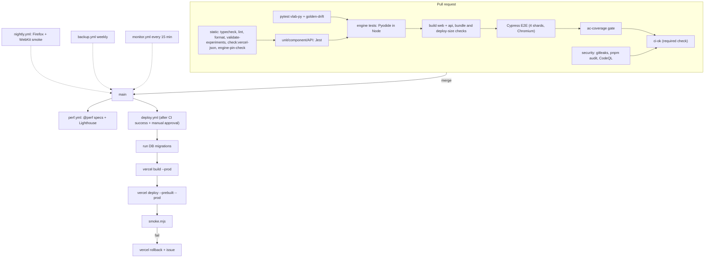

# V-Lab ECE: CI/CD (GitHub Actions)

> **Agent instruction:** create the files exactly as specified. Pin every third-party action to a **full commit SHA** at implementation time and keep the tag in a trailing comment (shown here as tags for readability). Workflows use least-privilege `permissions`. Secrets are never available to forked-PR runs.

## 1. Pipeline Overview



## 2. `.github/workflows/ci.yml`

```yaml
name: CI
on:
  pull_request:
  push:
    branches: [main]
concurrency:
  group: ci-${{ github.workflow }}-${{ github.ref }}
  cancel-in-progress: true
permissions:
  contents: read
env:
  TURBO_TELEMETRY_DISABLED: "1"
  CI: "true"

jobs:
  static:
    runs-on: ubuntu-24.04
    timeout-minutes: 15
    steps:
      - uses: actions/checkout@v4
      - uses: pnpm/action-setup@v4
        with: { version: 10 }
      - uses: actions/setup-node@v4
        with: { node-version-file: .nvmrc, cache: pnpm }
      - run: pnpm install --frozen-lockfile
      - run: pnpm turbo run typecheck
      - run: pnpm lint # eslint . --max-warnings 0
      - run: pnpm format:check # prettier --check .
      - run: pnpm validate-experiments
      - run: pnpm check:vercel-json
      - run: pnpm engine-pin-check # lockfile versions == tests/golden/ENGINE_VERSIONS.json

  python:
    runs-on: ubuntu-24.04
    timeout-minutes: 15
    steps:
      - uses: actions/checkout@v4
      - uses: actions/setup-python@v5
        with: { python-version: "3.14" } # fall back to 3.13 only if numpy/scipy wheels are unavailable; record it
      - run: pip install -r packages/vlab-py/requirements-dev.txt -r packages/experiments/tools/requirements-golden.txt
      - run: ruff check packages/vlab-py && ruff format --check packages/vlab-py
      - run: mypy --strict packages/vlab-py/vlab
      - run: pytest packages/vlab-py/tests -q
      - name: golden-drift (regenerate and compare within manifest tolerances)
        run: python packages/experiments/tools/check_golden_drift.py --golden tests/golden

  unit:
    runs-on: ubuntu-24.04
    timeout-minutes: 20
    strategy:
      fail-fast: false
      matrix:
        project: [shared, web, api]
    steps:
      - uses: actions/checkout@v4
      - uses: pnpm/action-setup@v4
        with: { version: 10 }
      - uses: actions/setup-node@v4
        with: { node-version-file: .nvmrc, cache: pnpm }
      - run: pnpm install --frozen-lockfile
      - run: pnpm jest --selectProjects ${{ matrix.project }} --coverage --ci --reporters=default --reporters=jest-junit
      - uses: actions/upload-artifact@v4
        if: always()
        with:
          name: junit-${{ matrix.project }}
          path: junit.xml
          retention-days: 14

  engine:
    runs-on: ubuntu-24.04
    timeout-minutes: 30
    needs: [static]
    steps:
      - uses: actions/checkout@v4
      - uses: pnpm/action-setup@v4
        with: { version: 10 }
      - uses: actions/setup-node@v4
        with: { node-version-file: .nvmrc, cache: pnpm }
      - run: pnpm install --frozen-lockfile
      - name: Cache Pyodide packages
        uses: actions/cache@v4
        with:
          path: node_modules/pyodide
          key: pyodide-${{ hashFiles('pnpm-lock.yaml') }}
      - run: pnpm jest --selectProjects engine --ci --runInBand=false --maxWorkers=2

  build:
    runs-on: ubuntu-24.04
    timeout-minutes: 20
    needs: [static, unit]
    steps:
      - uses: actions/checkout@v4
      - uses: pnpm/action-setup@v4
        with: { version: 10 }
      - uses: actions/setup-node@v4
        with: { node-version-file: .nvmrc, cache: pnpm }
      - run: pnpm install --frozen-lockfile
      - run: pnpm turbo run build --filter=@vlab/web --filter=@vlab/api
        env: { VITE_APP_VERSION: "${{ github.sha }}" }
      - run: pnpm check:bundle-size # AC-PERF-001
      - run: pnpm check:deploy-size # AC-DEP-004
      - run: pnpm check:no-test-hooks # AC-DEP-003: no __vlabTest in production bundle
      - uses: actions/upload-artifact@v4
        with:
          name: web-dist
          path: apps/web/dist
          retention-days: 3

  e2e:
    runs-on: ubuntu-24.04
    timeout-minutes: 30
    needs: [build, engine]
    strategy:
      fail-fast: false
      matrix:
        shard: [1, 2, 3, 4]
    steps:
      - uses: actions/checkout@v4
      - uses: pnpm/action-setup@v4
        with: { version: 10 }
      - uses: actions/setup-node@v4
        with: { node-version-file: .nvmrc, cache: pnpm }
      - run: pnpm install --frozen-lockfile
      - run: pnpm turbo run build:e2e --filter=@vlab/web --filter=@vlab/api # builds with VITE_E2E=1
      - uses: cypress-io/github-action@v6
        with:
          install: false
          start: pnpm e2e:serve # vite preview (4173, security headers) + API with in-memory Mongo
          wait-on: "http://localhost:4173/api/health"
          wait-on-timeout: 120
          browser: chrome
          spec: "cypress/e2e/**/*.cy.ts"
        env:
          SPLIT: 4
          SPLIT_INDEX: ${{ matrix.shard | int - 1 }} # zero-based index for cypress-split
          E2E_PASSWORD: ${{ secrets.E2E_PASSWORD }}
          CYPRESS_grepTags: "-@perf"
      - uses: actions/upload-artifact@v4
        if: failure()
        with:
          name: cypress-artifacts-${{ matrix.shard }}
          path: |
            cypress/screenshots
            cypress/results
          retention-days: 7

  ac-coverage:
    runs-on: ubuntu-24.04
    needs: [unit, python, engine, e2e]
    if: always() && !cancelled()
    steps:
      - uses: actions/checkout@v4
      - uses: pnpm/action-setup@v4
        with: { version: 10 }
      - uses: actions/setup-node@v4
        with: { node-version-file: .nvmrc, cache: pnpm }
      - run: pnpm install --frozen-lockfile
      - run: pnpm ac-coverage --out ac-matrix.md
      - uses: actions/upload-artifact@v4
        with: { name: ac-matrix, path: ac-matrix.md, retention-days: 30 }

  ci-ok:
    runs-on: ubuntu-24.04
    needs: [static, python, unit, engine, build, e2e, ac-coverage, security]
    if: always()
    steps:
      - name: Require all upstream jobs to succeed
        run: |
          echo '${{ toJSON(needs) }}' | jq -e 'to_entries | all(.value.result == "success")'
```

Notes for the agent:

- `security` is the job in `security.yml` exposed through `workflow_call`; add `security: { uses: ./.github/workflows/security.yml }` to this file as a job (a reusable-workflow job), keeping the name `security`.
- The `SPLIT_INDEX` expression above is illustrative: compute a zero-based index with a matrix of `[0,1,2,3]` instead, and name the matrix key `shard`. Use the `cypress-split` package (add with the pin protocol); if shard balancing is poor, switch to explicit spec lists.
- `build:e2e` must set `VITE_E2E=1` and **must not be reused** for deployment artefacts.

## 3. `.github/workflows/security.yml`

```yaml
name: Security
on:
  workflow_call:
  schedule:
    - cron: "17 2 * * 1" # weekly Monday 02:17 UTC
permissions:
  contents: read
  security-events: write
jobs:
  security:
    runs-on: ubuntu-24.04
    timeout-minutes: 25
    steps:
      - uses: actions/checkout@v4
        with: { fetch-depth: 0 }
      - uses: pnpm/action-setup@v4
        with: { version: 10 }
      - uses: actions/setup-node@v4
        with: { node-version-file: .nvmrc, cache: pnpm }
      - run: pnpm install --frozen-lockfile
      - name: Dependency audit (production deps, high+)
        run: pnpm audit --prod --audit-level=high
      - name: Secret scan
        uses: gitleaks/gitleaks-action@v2
        env: { GITHUB_TOKEN: "${{ secrets.GITHUB_TOKEN }}" }
      - name: Forbidden-pattern scan (eval, dangerouslySetInnerHTML, third-party origins)
        run: pnpm check:forbidden-patterns
      - name: No code-evaluation routes in API (AC-ASG-004)
        run: pnpm check:no-code-eval-routes
      - name: Python escape corpus against PolicyGuard
        run: pnpm jest --selectProjects engine --testPathPattern security
      - uses: github/codeql-action/init@v3
        with: { languages: javascript-typescript }
      - uses: github/codeql-action/analyze@v3
```

Scripts:

- `check:forbidden-patterns`: fails if source contains `dangerouslySetInnerHTML`, `.innerHTML =`, `eval(`, `new Function(`, or URLs to hosts outside an allowlist (`localhost`, institute domain, `w3.org` for namespaces) in `apps/web/src`, `index.html`, and CSS.
- `check:no-code-eval-routes`: static scan of `apps/api/src` for imports of `vm`, `child_process`, `worker_threads`, `Function(`, `eval(` (complements the ESLint rule).

## 4. `.github/workflows/perf.yml` (main and release branches)

```yaml
name: Performance
on:
  push:
    branches: [main, "release/**"]
  workflow_dispatch:
permissions:
  contents: read
jobs:
  perf:
    runs-on: ubuntu-24.04
    timeout-minutes: 40
    steps:
      - uses: actions/checkout@v4
      - uses: pnpm/action-setup@v4
        with: { version: 10 }
      - uses: actions/setup-node@v4
        with: { node-version-file: .nvmrc, cache: pnpm }
      - run: pnpm install --frozen-lockfile
      - run: pnpm turbo run build:e2e --filter=@vlab/web --filter=@vlab/api
      - uses: cypress-io/github-action@v6
        with:
          install: false
          start: pnpm e2e:serve
          wait-on: "http://localhost:4173/api/health"
          browser: chrome
          spec: "cypress/e2e/**/*.cy.ts"
        env:
          CYPRESS_grepTags: "@perf"
          CI_TIMING_FACTOR: "1.0"
      - uses: treosh/lighthouse-ci-action@v12
        with:
          configPath: ./lighthouserc.json # AC-UI-005, AC-PERF-002
          uploadArtifacts: true
      - uses: actions/upload-artifact@v4
        if: always()
        with: { name: perf-results, path: cypress/results/perf, retention-days: 60 }
```

`lighthouserc.json` asserts: performance ≥ 0.85, accessibility ≥ 0.95, best-practices ≥ 0.95 on `/login` and `/catalog`, with mobile emulation and the "Fast 4G" throttling preset (AC-PERF-002: LCP ≤ 2500 ms on the login page).

## 5. `.github/workflows/nightly.yml` (cross-browser smoke)

```yaml
name: Nightly cross-browser
on:
  schedule:
    - cron: "30 20 * * *" # 02:00 IST
  workflow_dispatch:
permissions:
  contents: read
jobs:
  smoke:
    runs-on: ubuntu-24.04
    timeout-minutes: 30
    strategy:
      fail-fast: false
      matrix:
        browser: [firefox, webkit]
    continue-on-error: ${{ matrix.browser == 'webkit' }} # Cypress WebKit support is experimental
    steps:
      - uses: actions/checkout@v4
      - uses: pnpm/action-setup@v4
        with: { version: 10 }
      - uses: actions/setup-node@v4
        with: { node-version-file: .nvmrc, cache: pnpm }
      - run: pnpm install --frozen-lockfile
      - run: pnpm turbo run build:e2e --filter=@vlab/web --filter=@vlab/api
      - uses: cypress-io/github-action@v6
        with:
          install: false
          start: pnpm e2e:serve
          wait-on: "http://localhost:4173/api/health"
          browser: ${{ matrix.browser }}
          spec: "cypress/e2e/smoke/**/*.cy.ts"
```

On failure, `scripts/open-issue.mjs` (a small `gh api` wrapper) opens or updates the issue "Nightly smoke failing on <browser>" with the run URL.

## 6. `.github/workflows/deploy.yml` (production)

```yaml
name: Deploy production
on:
  workflow_run:
    workflows: [CI]
    types: [completed]
    branches: [main]
permissions:
  contents: read
concurrency:
  group: deploy-production
  cancel-in-progress: false
env:
  VERCEL_ORG_ID: ${{ secrets.VERCEL_ORG_ID }}
  VERCEL_PROJECT_ID: ${{ secrets.VERCEL_PROJECT_ID }}
jobs:
  deploy:
    if: ${{ github.event.workflow_run.conclusion == 'success' }}
    runs-on: ubuntu-24.04
    timeout-minutes: 30
    environment:
      name: production # required reviewers (2 maintainers)
      url: ${{ steps.deploy.outputs.url }}
    steps:
      - uses: actions/checkout@v4
        with: { ref: "${{ github.event.workflow_run.head_sha }}" }
      - uses: pnpm/action-setup@v4
        with: { version: 10 }
      - uses: actions/setup-node@v4
        with: { node-version-file: .nvmrc, cache: pnpm }
      - run: pnpm install --frozen-lockfile
      - name: Apply database migrations
        run: pnpm --filter @vlab/api migrate
        env:
          {
            MONGODB_URI_MIGRATE: "${{ secrets.MONGODB_URI_MIGRATE }}",
            MIGRATE_TARGET_DB: vlab_prod,
          }
      - name: Pull Vercel environment
        run: pnpm dlx vercel@latest pull --yes --environment=production --token=${{ secrets.VERCEL_TOKEN }}
      - name: Build
        run: pnpm dlx vercel@latest build --prod --token=${{ secrets.VERCEL_TOKEN }}
        env: { VITE_APP_VERSION: "${{ github.event.workflow_run.head_sha }}" }
      - name: Deploy
        id: deploy
        run: |
          url=$(pnpm dlx vercel@latest deploy --prebuilt --prod --token=${{ secrets.VERCEL_TOKEN }})
          echo "url=$url" >> "$GITHUB_OUTPUT"
      - name: Smoke test
        id: smoke
        run: node scripts/smoke.mjs "${{ steps.deploy.outputs.url }}"
      - name: Roll back on failed smoke test
        if: failure() && steps.deploy.outcome == 'success'
        run: |
          pnpm dlx vercel@latest rollback --token=${{ secrets.VERCEL_TOKEN }} --yes
          node scripts/open-issue.mjs "Production deploy rolled back" "Smoke test failed for ${{ github.event.workflow_run.head_sha }}"
```

Agent notes:

- Replace `vercel@latest` with an exact pinned CLI version (pin protocol) in `package.json` and run `pnpm exec vercel`; `latest` is shown only for brevity and violates the pin rule.
- `vercel rollback` semantics must be verified in the preview project; if the CLI syntax differs, use `vercel promote <previous-deployment-url>`.
- The migration step runs **before** the new build serves traffic; migrations must be backward compatible (`DEPLOYMENT.md` §6).

## 7. `.github/workflows/preview-smoke.yml` (optional but recommended)

```yaml
name: Preview smoke
on:
  deployment_status:
permissions:
  contents: read
  deployments: read
jobs:
  smoke:
    if: github.event.deployment_status.state == 'success' && github.event.deployment.environment == 'Preview'
    runs-on: ubuntu-24.04
    steps:
      - uses: actions/checkout@v4
      - uses: actions/setup-node@v4
        with: { node-version-file: .nvmrc }
      - run: node scripts/smoke.mjs "${{ github.event.deployment_status.target_url }}"
        env: { VERCEL_AUTOMATION_BYPASS_SECRET: "${{ secrets.VERCEL_AUTOMATION_BYPASS_SECRET }}" } # needed if preview protection is on
```

## 8. Scheduled Operations

### 8.1 `.github/workflows/backup.yml`

```yaml
name: Weekly backup
on:
  schedule:
    - cron: "0 21 * * 0" # Sunday 21:00 UTC = Monday 02:30 IST
  workflow_dispatch:
permissions:
  contents: read
jobs:
  backup:
    runs-on: ubuntu-24.04
    environment: production
    timeout-minutes: 30
    steps:
      - uses: actions/checkout@v4
      - name: Install tools
        run: |
          sudo apt-get update && sudo apt-get install -y age rclone
          # install mongodb-database-tools per MongoDB's apt repo instructions (pin version)
      - name: Dump, encrypt, upload
        env:
          MONGODB_URI_BACKUP: ${{ secrets.MONGODB_URI_BACKUP }} # read-only user
          AGE_RECIPIENT: ${{ secrets.BACKUP_AGE_RECIPIENT }}
          RCLONE_CONFIG_B64: ${{ secrets.RCLONE_CONFIG_B64 }}
          RCLONE_REMOTE: ${{ vars.BACKUP_RCLONE_REMOTE }} # e.g. department storage remote name
        run: |
          set -euo pipefail
          umask 077
          ts=$(date -u +%Y%m%dT%H%M%SZ)
          mongodump --uri="$MONGODB_URI_BACKUP" --db=vlab_prod --archive --gzip \
            | age -r "$AGE_RECIPIENT" > "vlab_prod_${ts}.archive.gz.age"
          echo "$RCLONE_CONFIG_B64" | base64 -d > rclone.conf
          rclone --config rclone.conf copy "vlab_prod_${ts}.archive.gz.age" "${RCLONE_REMOTE}/vlab-backups/"
          rclone --config rclone.conf delete --min-age 56d "${RCLONE_REMOTE}/vlab-backups/"
          shred -u rclone.conf "vlab_prod_${ts}.archive.gz.age"
```

The backup storage remote (institute NAS, Google Drive, or S3-compatible bucket) is chosen by the department; the dump is **never** stored as a GitHub artifact (personal data). If `mongodump` is unsupported on the cluster tier, call `scripts/export-collections.ts` instead.

### 8.2 `.github/workflows/monitor.yml` (uptime and error-rate alerts)

Specified in `MONITORING.md` §8.

## 9. Repository Protection and Governance

| Setting                                | Value                                                                                                                                                                                                  |
| -------------------------------------- | ------------------------------------------------------------------------------------------------------------------------------------------------------------------------------------------------------ |
| Default branch                         | `main`, protected                                                                                                                                                                                      |
| Required status checks                 | `ci-ok` (single aggregate), plus `Vercel` preview deployment                                                                                                                                           |
| Required reviews                       | 1 approving review (CODEOWNERS for `/docs/security`, `/apps/api/src/middleware`, `vercel.json`, `.github/**`, `apps/web/src/engine/worker/**`, `packages/vlab-py/vlab/policy.py` require a maintainer) |
| Merge method                           | Squash; linear history                                                                                                                                                                                 |
| Force-push / deletion on `main`        | Disabled                                                                                                                                                                                               |
| Signed commits                         | Recommended; required for maintainers                                                                                                                                                                  |
| Fork PRs                               | Run CI without secrets; no deploys                                                                                                                                                                     |
| Actions policy                         | Allow only GitHub-owned actions plus the explicit list in this file; **pin to SHAs**                                                                                                                   |
| Workflow permissions default           | Read-only; each job escalates explicitly                                                                                                                                                               |
| Secret scanning + push protection      | On                                                                                                                                                                                                     |
| Dependabot alerts and security updates | On                                                                                                                                                                                                     |

`.github/dependabot.yml`:

```yaml
version: 2
updates:
  - package-ecosystem: npm
    directory: /
    schedule: { interval: weekly, day: monday }
    versioning-strategy: increase
    open-pull-requests-limit: 5
    groups:
      minor-and-patch: { update-types: [minor, patch] }
    ignore:
      - {
          dependency-name: pyodide,
          update-types:
            [version-update:semver-major, version-update:semver-minor, version-update:semver-patch],
        } # Pyodide upgrades follow UPGRADING_PYODIDE.md
  - package-ecosystem: github-actions
    directory: /
    schedule: { interval: weekly }
  - package-ecosystem: pip
    directory: /packages/experiments/tools
    schedule: { interval: monthly }
    ignore:
      - { dependency-name: numpy }
      - { dependency-name: scipy } # must equal ENGINE_VERSIONS.json
```

## 10. Secrets Inventory (GitHub)

| Secret                                               | Scope                    | Purpose                 |
| ---------------------------------------------------- | ------------------------ | ----------------------- |
| `VERCEL_TOKEN`, `VERCEL_ORG_ID`, `VERCEL_PROJECT_ID` | Environment `production` | Deploy                  |
| `MONGODB_URI_MIGRATE`                                | Environment `production` | Migrations              |
| `MONGODB_URI_BACKUP`                                 | Environment `production` | Read-only dump user     |
| `BACKUP_AGE_RECIPIENT`, `RCLONE_CONFIG_B64`          | Environment `production` | Encrypted backup upload |
| `E2E_PASSWORD`                                       | Repository               | Seeded test users       |
| `MONITOR_TOKEN`, `MONITOR_BASE_URL`                  | Repository               | Monitoring workflow     |
| `VERCEL_AUTOMATION_BYPASS_SECRET`                    | Repository               | Preview smoke test      |

Rotation: every 6 months and on staff changes; record in `OPERATIONS.md`.

## 11. Build Caching and Speed Targets

| Item              | Approach                                                               | Target                |
| ----------------- | ---------------------------------------------------------------------- | --------------------- |
| pnpm store        | `setup-node` cache `pnpm`                                              | install ≤ 60 s        |
| Turborepo         | Local cache restored via `actions/cache` keyed by lockfile and git SHA | repeat builds ≤ 2 min |
| Pyodide in Node   | Cached `node_modules/pyodide`                                          | engine job ≤ 10 min   |
| Cypress binary    | Cached by `cypress-io/github-action`                                   | E2E shard ≤ 8 min     |
| Total PR pipeline |                                                                        | ≤ 20 min wall clock   |

## 12. Release Process

1. Create `release/vX.Y.Z` from `main` when the milestone gate (MILESTONES §9) is ready; run `perf.yml` there.
2. Complete `QA_CHECKLIST.md` and `SECURITY_CHECKLIST.md` for the milestone.
3. Tag `vX.Y.Z` on `main`; `deploy.yml` deploys the tagged commit after approval.
4. Publish release notes (`docs/releases/vX.Y.Z.md`): features, migrations, flags, known issues, rollback target.
