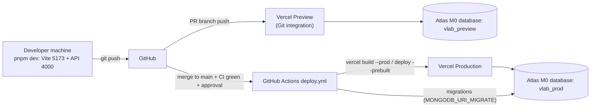

# V-Lab ECE: Deployment (Vercel + MongoDB Atlas)

> **Agent instruction:** Everything under "Repository changes" is implemented by tasks T-008, T-009 and T-010 (and extended in T-084). Everything under "Operator runbook" is performed by a human with account access; the agent must produce the scripts and checks, not credentials.

## 1. Topology and Environments



| Environment | URL                                                          | Database                                                             | Branch      | Notes                                                            |
| ----------- | ------------------------------------------------------------ | -------------------------------------------------------------------- | ----------- | ---------------------------------------------------------------- |
| Local       | `http://localhost:5173` (web), `http://localhost:4000` (API) | Local `mongodb-memory-server` or personal Atlas DB `vlab_dev_<name>` | any         | Vite proxies `/api` to 4000; CORS allows `http://localhost:5173` |
| E2E (CI)    | `http://localhost:4173` (vite preview)                       | In-memory Mongo                                                      | PR          | Same headers as production via `security-headers.ts`             |
| Preview     | `https://<project>-git-<branch>-<team>.vercel.app`           | `vlab_preview` (separate DB user)                                    | PR branches | Seeded test data; no real student data, ever                     |
| Production  | `https://<production-domain>`                                | `vlab_prod`                                                          | `main`      | Real data; deploys only via `deploy.yml`                         |

Production domain is decided by the department (for example a subdomain of the institute's domain). Until it is decided, production uses the Vercel-assigned domain and **HSTS preload stays off** (see §7).

## 2. Accounts and Access (human prerequisites)

| Item            | Requirement                                                                                                                                                                                                                                                                  |
| --------------- | ---------------------------------------------------------------------------------------------------------------------------------------------------------------------------------------------------------------------------------------------------------------------------- |
| GitHub          | Organisation or department-owned repo; branch protection per `CI_CD.md` §9; at least 2 maintainers                                                                                                                                                                           |
| Vercel          | Team owned by the department, not a personal account. **Check the plan terms:** Vercel's free Hobby plan is intended for non-commercial personal use; an institutional deployment may need the Pro plan or a Vercel education/open-source arrangement. Confirm before pilot. |
| MongoDB Atlas   | Organisation owned by the department; one project `vlab`; M0 cluster (see §5)                                                                                                                                                                                                |
| Email provider  | Transactional only (password reset). Provider chosen by the department; API key stored as `EMAIL_API_KEY`                                                                                                                                                                    |
| DNS             | Department IT controls the domain; needs one `CNAME`/`A` record for Vercel                                                                                                                                                                                                   |
| Secrets custody | Two named people hold access to the Vercel and Atlas owner roles (bus factor)                                                                                                                                                                                                |

## 3. Repository Changes

### 3.1 Vercel project settings (set in dashboard, mirrored in `docs/runbooks/VERCEL_SETTINGS.md`)

| Setting                            | Value                                                                                                                    |
| ---------------------------------- | ------------------------------------------------------------------------------------------------------------------------ |
| Framework preset                   | Vite                                                                                                                     |
| Root directory                     | `.` (repository root)                                                                                                    |
| Install command                    | `pnpm install --frozen-lockfile`                                                                                         |
| Build command                      | `pnpm turbo run build --filter=@vlab/web --filter=@vlab/api`                                                             |
| Output directory                   | `apps/web/dist`                                                                                                          |
| Node.js version                    | 24.x (fallback 22.x if unavailable)                                                                                      |
| Auto-deploy production from `main` | **Disabled** (`git.deploymentEnabled.main = false` in `vercel.json`); production deploys come from `deploy.yml` after CI |
| Preview deployments                | Enabled for all non-`main` branches                                                                                      |
| Deployment protection              | Preview deployments protected (Vercel Authentication) so team members only; production public                            |
| Function region                    | Mumbai (`bom1`) to sit near the Atlas `ap-south-1` cluster and the users                                                 |

### 3.2 API function entry (`/api/index.ts` at repo root)

Vercel serves a default-exported Express app from `api/index.ts`. To avoid compiling workspace TypeScript sources at deploy time, the API is **pre-bundled** by `tsup` during `turbo build` into `apps/api/dist/app.mjs` (workspace packages inlined, third-party packages external) and re-exported:

```ts
// api/index.ts
import app from "../apps/api/dist/app.mjs";
export default app;
```

`apps/api/tsup.config.ts`:

```ts
import { defineConfig } from "tsup";
export default defineConfig({
  entry: { app: "src/app.ts" },
  format: ["esm"],
  target: "node24",
  platform: "node",
  outDir: "dist",
  clean: true,
  sourcemap: true,
  splitting: false,
  noExternal: [/^@vlab\//], // inline workspace packages
  external: [
    "mongoose",
    "express",
    "jose",
    "bcryptjs",
    "helmet",
    "cors",
    "cookie",
    "pino",
    "zod",
    "csv-parse",
    "csv-stringify",
  ],
});
```

Add `tsup` to dev dependencies using the pin protocol. `apps/api/src/app.ts` **exports the app and never calls `listen`** (local dev uses `src/server.ts`).
If the bundled approach fails on the Vercel preview (file tracing misses a dependency), add `"functions": { "api/index.ts": { "includeFiles": "apps/api/dist/**" } }` (already present below); if it still fails, record a blocker and fall back to compiling `api/index.ts` directly with workspace packages built to `dist` and referenced via `exports`.

### 3.3 `vercel.json` (final, generated)

`vercel.json` is **generated** by `scripts/gen-vercel-json.ts` from `apps/web/security-headers.ts` (single source of truth for CSP/COOP/COEP) and verified in CI (`pnpm check:vercel-json` fails if the committed file differs from generator output).

```json
{
  "$schema": "https://openapi.vercel.sh/vercel.json",
  "regions": ["bom1"],
  "git": { "deploymentEnabled": { "main": false } },
  "functions": {
    "api/index.ts": { "maxDuration": 10, "includeFiles": "apps/api/dist/**" }
  },
  "headers": [
    {
      "source": "/(.*)",
      "headers": [
        { "key": "Cross-Origin-Opener-Policy", "value": "same-origin" },
        { "key": "Cross-Origin-Embedder-Policy", "value": "require-corp" },
        { "key": "Cross-Origin-Resource-Policy", "value": "same-origin" },
        { "key": "Strict-Transport-Security", "value": "max-age=63072000; includeSubDomains" },
        { "key": "X-Content-Type-Options", "value": "nosniff" },
        { "key": "Referrer-Policy", "value": "strict-origin-when-cross-origin" },
        {
          "key": "Permissions-Policy",
          "value": "camera=(), microphone=(), geolocation=(), payment=(), usb=(), serial=(), bluetooth=()"
        },
        { "key": "X-Frame-Options", "value": "DENY" },
        {
          "key": "Content-Security-Policy",
          "value": "default-src 'self'; script-src 'self' 'wasm-unsafe-eval'; style-src 'self' 'unsafe-inline'; img-src 'self' data: blob:; font-src 'self'; connect-src 'self'; worker-src 'self' blob:; manifest-src 'self'; object-src 'none'; base-uri 'none'; form-action 'self'; frame-ancestors 'none'; upgrade-insecure-requests"
        }
      ]
    },
    {
      "source": "/assets/workers/(.*)",
      "headers": [
        {
          "key": "Content-Security-Policy",
          "value": "default-src 'none'; script-src 'self' 'wasm-unsafe-eval' 'unsafe-eval'; connect-src 'self'; worker-src 'none'; img-src 'none'; style-src 'none'"
        },
        { "key": "Cross-Origin-Resource-Policy", "value": "same-origin" },
        { "key": "Cache-Control", "value": "public, max-age=31536000, immutable" }
      ]
    },
    {
      "source": "/assets/(.*)",
      "headers": [{ "key": "Cache-Control", "value": "public, max-age=31536000, immutable" }]
    },
    {
      "source": "/pyodide/(.*)",
      "headers": [{ "key": "Cache-Control", "value": "public, max-age=31536000, immutable" }]
    },
    {
      "source": "/opencv/(.*)",
      "headers": [{ "key": "Cache-Control", "value": "public, max-age=31536000, immutable" }]
    },
    {
      "source": "/sw.js",
      "headers": [
        { "key": "Cache-Control", "value": "no-cache" },
        { "key": "Service-Worker-Allowed", "value": "/" }
      ]
    },
    { "source": "/index.html", "headers": [{ "key": "Cache-Control", "value": "no-cache" }] },
    { "source": "/api/(.*)", "headers": [{ "key": "Cache-Control", "value": "no-store" }] }
  ],
  "rewrites": [
    { "source": "/api/(.*)", "destination": "/api" },
    {
      "source": "/((?!api/|pyodide/|opencv/|assets/|sw\\.js|favicon\\.ico|manifest\\.webmanifest).*)",
      "destination": "/index.html"
    }
  ]
}
```

Differences from `SECURITY_ARCHITECTURE.md` §7: HSTS `preload` removed (re-enable only after §7 conditions), caching headers added, `regions` and `functions` added. The Vite build must emit workers to `assets/workers/` (`worker.rollupOptions.output.entryFileNames = "assets/workers/[name]-[hash].js"`).
Tell the agent to confirm the exact `rewrites` semantics on a preview deployment: `/api/anything` must reach Express, `/lab/DSP-01` must return `index.html`, and `/pyodide/314.0.3/pyodide.asm.wasm` must return the file (not `index.html`) with `Content-Type: application/wasm`.

### 3.4 Pyodide and static asset size control (T-009)

- `scripts/copy-pyodide.mjs` copies **only** the core runtime files and the wheels required for `numpy`, `scipy`, `matplotlib` plus their dependencies (resolve the closure from `pyodide-lock.json`; do not copy the whole distribution). Write the resulting list to `apps/web/public/pyodide/314.0.3/MANIFEST.json` with SHA-256 per file.
- Build-time integrity: the script verifies each file's SHA-256 against `pyodide-lock.json` where the lock file records one, and fails otherwise.
- `scripts/check-deploy-size.mjs` prints the total static size and fails if it exceeds `DEPLOY_STATIC_BUDGET_MB`. **Set the budget after the first measurement and after checking the current Vercel deployment and file-size limits for the chosen plan.** Record both numbers in `docs/runbooks/VERCEL_SETTINGS.md`.
- **Contingency if the limits are tight:** host `/pyodide/*` and `/opencv/*` on a same-site asset hostname (for example `assets.<domain>`) served with `Cross-Origin-Resource-Policy: same-site` and `Access-Control-Allow-Origin: https://<app-domain>`; add that host to `connect-src`, `script-src` (worker only), and update the SW allowlist. This needs a new ADR (ADR-016) because it relaxes ADR-012 and ADR-006's single-origin property.

### 3.5 Environment validation (`apps/api/src/config/env.ts`)

```ts
import { z } from "zod";

const schema = z.object({
  NODE_ENV: z.enum(["development", "test", "production"]),
  MONGODB_URI: z.string().startsWith("mongodb"),
  JWT_ACCESS_SECRET: z.string().min(44), // 32 bytes base64 ≈ 44 chars
  JWT_ACCESS_SECRET_PREV: z.string().min(44).optional(),
  REFRESH_TOKEN_PEPPER: z.string().min(44),
  IP_HASH_SECRET: z.string().min(44),
  ALLOWED_EMAIL_DOMAINS: z.string().min(3),
  CORS_ALLOWED_ORIGINS: z.string().default(""),
  APP_BASE_URL: z.url(),
  EMAIL_API_KEY: z.string().min(8),
  EMAIL_FROM: z.email(),
  MONITOR_TOKEN: z.string().min(32),
  ERASE_KEEPS_GRADES: z.enum(["true", "false"]).default("false"),
  VERCEL_GIT_COMMIT_SHA: z.string().optional(),
});
export const env = schema.parse(process.env); // fails fast at cold start
```

Production boot **must fail** if `CORS_ALLOWED_ORIGINS` is non-empty while `NODE_ENV === "production"` unless `ALLOW_PROD_CORS=1` is set (prevents accidental wildcarding).

## 4. Environment Variables

| Variable                                                          | Production                                     | Preview                                              | Dev/CI                  | Secret      | Notes                                                           |
| ----------------------------------------------------------------- | ---------------------------------------------- | ---------------------------------------------------- | ----------------------- | ----------- | --------------------------------------------------------------- |
| `MONGODB_URI`                                                     | yes (user `vlab_app_prod`, db `vlab_prod`)     | yes (user `vlab_app_preview`, db `vlab_preview`)     | local                   | yes         | Least-privilege `readWrite` on its DB only                      |
| `MONGODB_URI_MIGRATE`                                             | GitHub Actions secret only                     | no                                                   | no                      | yes         | User with `dbAdmin` for validators and indexes; never in Vercel |
| `JWT_ACCESS_SECRET`                                               | yes                                            | yes (different value)                                | test value              | yes         | `openssl rand -base64 32`                                       |
| `JWT_ACCESS_SECRET_PREV`                                          | during rotation                                | no                                                   | no                      | yes         | Verification-only secret during rotation                        |
| `REFRESH_TOKEN_PEPPER`                                            | yes                                            | yes                                                  | test                    | yes         | Rotating it logs everyone out; acceptable                       |
| `IP_HASH_SECRET`                                                  | yes                                            | yes                                                  | test                    | yes         | HMAC key for IP hashing (PRIVACY)                               |
| `ALLOWED_EMAIL_DOMAINS`                                           | `iitism.ac.in,students.iitism.ac.in` (confirm) | same                                                 | same                    | no          |                                                                 |
| `CORS_ALLOWED_ORIGINS`                                            | empty                                          | empty (same-origin previews)                         | `http://localhost:5173` | no          |                                                                 |
| `APP_BASE_URL`                                                    | production URL                                 | preview URL (set via build script from `VERCEL_URL`) | `http://localhost:5173` | no          | Used in reset-email links                                       |
| `EMAIL_API_KEY`, `EMAIL_FROM`                                     | yes                                            | sandbox key                                          | none                    | key: yes    |                                                                 |
| `MONITOR_TOKEN`                                                   | yes                                            | no                                                   | no                      | yes         | For `/api/ops/summary` (MONITORING)                             |
| `ERASE_KEEPS_GRADES`                                              | `false` unless counsel says otherwise          | `false`                                              | `false`                 | no          | PRIVACY §8                                                      |
| `VITE_APP_VERSION`                                                | set at build from `VERCEL_GIT_COMMIT_SHA`      | same                                                 | `dev`                   | no (public) | Release id for monitoring                                       |
| `VITE_FEATURE_ASSIGNMENTS`, `VITE_FEATURE_DIP`, `VITE_FEATURE_PG` | per milestone                                  | `1`                                                  | `1`                     | no (public) | MILESTONES §8                                                   |
| `VITE_E2E`                                                        | **never set**                                  | **never set**                                        | CI e2e build only       | no          | CI greps production bundles for `__vlabTest`                    |
| `E2E_PASSWORD`                                                    | no                                             | no                                                   | CI secret               | yes         |                                                                 |
| `VERCEL_TOKEN`, `VERCEL_ORG_ID`, `VERCEL_PROJECT_ID`              | GitHub Actions secrets                         |                                                      |                         | yes         |                                                                 |

Rules: values prefixed `VITE_` are public and visible in the bundle; **no secrets in them**. `.env.example` lists names with empty values. Secrets are never printed in CI logs (use masked secrets, no `set -x` around them).

## 5. Operator Runbook

### 5.1 MongoDB Atlas (one-time)

1. Create Atlas organisation and project `vlab`. Create an **M0** cluster in AWS Mumbai (`ap-south-1`) if offered; otherwise the nearest region and record the reason.
2. Database users (password auth, 24+ random characters, stored in the department password manager):
   - `vlab_app_prod`: role `readWrite` on `vlab_prod`.
   - `vlab_app_preview`: role `readWrite` on `vlab_preview`.
   - `vlab_migrate`: role `dbAdmin` + `readWrite` on both DBs (CI only).
   - `vlab_audit_writer` semantics are enforced by custom role limiting `audit_logs` to `insert`/`find` for the app user where the tier supports custom roles; **M0 may not support custom roles**. If unsupported, enforce append-only in application code and record the limitation in `SECURITY_CHECKLIST.md`.
3. Network access: Vercel's egress IPs are not fixed on standard plans, so allow `0.0.0.0/0` **only** together with unique strong credentials, TLS (always on), and least-privilege users. Revisit if a static-egress option is adopted.
4. Enable Atlas alerts: connections > 80 % of the limit, storage > 80 %, ops/s throttling, auth failures spike. Alert email goes to the maintainers' shared mailbox.
5. Save the connection string (SRV) as Vercel env vars; do not paste into chat or tickets.

### 5.2 Vercel (one-time)

1. Create team, import the GitHub repo using §3.1 settings, set **Production** and **Preview** environment variables from §4.
2. Disable automatic production deployments from `main` (already in `vercel.json`), and add Vercel's GitHub integration permissions only for this repo.
3. Create the three GitHub Actions secrets `VERCEL_TOKEN` (scoped token), `VERCEL_ORG_ID`, `VERCEL_PROJECT_ID` (from `.vercel/project.json` after `vercel link`).
4. Create the GitHub **Environment** `production` with required reviewers (two maintainers) and restrict it to the `main` branch.

### 5.3 First production deployment

1. Run migrations against `vlab_prod` (the deploy workflow does this; for the first run execute `pnpm --filter @vlab/api migrate` locally with `MONGODB_URI_MIGRATE` to verify).
2. Seed: `pnpm --filter @vlab/api seed:courses` and `pnpm --filter @vlab/api create-admin -- --email <admin email>` (prints a one-time password reset link; no password is accepted on the command line or stored in shell history).
3. Merge to `main`; approve the `production` environment in `deploy.yml`.
4. Run §7 verification.
5. Import pilot students (`/admin/users` CSV import, 20 users first).

### 5.4 Domain, TLS, HSTS

1. Add the domain in Vercel, create the DNS record, wait for certificate issuance (automatic).
2. Set `APP_BASE_URL`. Redeploy.
3. **HSTS preload:** keep `max-age=63072000; includeSubDomains` without `preload` until the domain is final **and** every subdomain serves HTTPS; only then add `preload` and submit to the preload list (the process is hard to reverse).

## 6. Database Migrations

- Scripts in `apps/api/src/migrations/NNN-<name>.ts` export `up(db)` only. A `migrations` collection records `{ name, appliedAt, gitSha }`. `pnpm --filter @vlab/api migrate` applies pending migrations in order inside the deploy job **before** promoting the new build.
- **Expand/contract rule:** a migration must be compatible with both the previous and the new application version. Destructive changes (drop field/collection, tighten validators) happen in a **later** release after the code no longer needs the old shape.
- The validators from `DATABASE_DESIGN.md` are applied by migration `001-validators`; later schema changes are new migrations that update validators with `collMod`.
- Each migration has a test that runs it against `mongodb-memory-server` twice (idempotency).

## 7. Post-Deploy Verification (automated by `scripts/smoke.mjs`, also run manually)

```bash
BASE=https://<production-domain>
# 1. Security and isolation headers on HTML
curl -sI "$BASE/" | grep -iE "cross-origin-(opener|embedder|resource)-policy|content-security-policy|strict-transport-security|x-content-type-options"
# 2. Worker CSP is the worker-specific one
curl -sI "$BASE/assets/workers/$(curl -s $BASE/manifest.json | jq -r '.workerFile')" | grep -i content-security-policy
# 3. Wasm served with the correct type, immutable cache
curl -sI "$BASE/pyodide/314.0.3/pyodide.asm.wasm" | grep -iE "content-type|cache-control|HTTP/"
# 4. API health and no-store
curl -si "$BASE/api/health" | head -20
# 5. CORS denial for foreign origin
curl -si -H "Origin: https://evil.example" "$BASE/api/catalog/settings" | grep -i access-control-allow-origin || echo "OK: no ACAO header"
# 6. SPA fallback does not swallow assets
curl -sI "$BASE/pyodide/314.0.3/does-not-exist.js" | head -1   # expect 404, not 200 text/html
```

Manual browser checks (once per release): open DevTools console → `crossOriginIsolated === true`; load SS-01, press Run (Ready ≤ 15 s cold); confirm no network requests to third-party origins; confirm Service Worker active; log in as each role and open its landing page.

## 8. Rollback and Hotfix

| Situation                                              | Action                                                                                                                                                                                         |
| ------------------------------------------------------ | ---------------------------------------------------------------------------------------------------------------------------------------------------------------------------------------------- |
| Bad frontend/API release                               | In Vercel: **Instant Rollback** to the previous production deployment (or `vercel rollback`). Migrations are backward compatible (§6), so no DB rollback is needed                             |
| Engine broken for everyone (e.g., Pyodide asset issue) | Set `engineBlocked: true` in catalog settings through the admin kill-switch endpoint (MILESTONES §8), roll back, then fix                                                                      |
| Hotfix                                                 | Branch `hotfix/<id>` from `main`, PR with expedited review, same CI, approve production environment                                                                                            |
| Bad migration                                          | Restore from the last backup into a temporary database, compare, repair forward with a new migration; do not edit applied migrations                                                           |
| Leaked secret                                          | Rotate in Vercel + Atlas immediately; rotate `JWT_ACCESS_SECRET` using the two-secret procedure; revoke refresh families (`tokenVersion++` for all users via `scripts/revoke-all-sessions.ts`) |

## 9. Backups and Restore Drills

- Atlas M0 has **no continuous backup**. A weekly encrypted dump job (`backup.yml`, `CI_CD.md` §8) writes to department-controlled storage. **Check that `mongodump` works on the M0 tier at setup time**; if it does not, use the fallback script `scripts/export-collections.ts` (iterates collections and writes encrypted NDJSON).
- Restore drill: once per semester restore the latest dump into a scratch database and run `pnpm --filter @vlab/api verify:restore` (counts, referential checks, sample login). Record in `docs/runbooks/OPERATIONS.md`.
- Backups contain personal data: encrypted (age), access limited to two named people, retained 8 weeks, deleted afterwards (see `PRIVACY.md` §6).

## 10. Capacity, Limits, and Cost Checks (verify at setup; limits change)

| Item                                                 | Expectation                                                       | Check                                                                                                                                          |
| ---------------------------------------------------- | ----------------------------------------------------------------- | ---------------------------------------------------------------------------------------------------------------------------------------------- |
| Atlas M0 storage                                     | 512 MB (≈ 1,000 users at 50 KB average)                           | Alert at 80 % (≈ 410 MB); plan to move to a paid tier or prune `client_events`                                                                 |
| Atlas M0 connections and throughput                  | Limited; pool size 5 per instance                                 | Load test with 200 concurrent users in preview (k6 script in `tests/load/`, task T-084)                                                        |
| Vercel function duration, bandwidth, deployment size | Depends on plan                                                   | Record current numbers in `VERCEL_SETTINGS.md`; static Pyodide assets are served from CDN and cached for a year                                |
| First-load bandwidth                                 | Tens of MB per new student device                                 | 500 students ≈ tens of GB over a semester; check against the plan's bandwidth allowance; the optional campus LAN mirror (PRD §10) reduces this |
| Total monthly cost target                            | ₹0 on free tiers if plan terms allow; otherwise a single Pro seat | Decide before pilot (§2)                                                                                                                       |

## 11. Maintenance Mode

The kill switch (`engineBlocked`) shows a banner and disables Run; for a full outage message set `maintenance: true` in the same settings payload, which the SPA renders as a static page while still allowing logout. Both flags are editable by admins in `/admin/experiments` and via script when the API is down (`scripts/set-flags.ts` using `MONGODB_URI_MIGRATE`).

## 12. Deployment Acceptance Criteria (add to CI smoke)

| ID         | Criterion                                                                        |
| ---------- | -------------------------------------------------------------------------------- |
| AC-DEP-001 | After deploy, `scripts/smoke.mjs` passes the six header and routing checks in §7 |
| AC-DEP-002 | `vercel.json` equals the generator output (`check:vercel-json`)                  |
| AC-DEP-003 | Production bundle contains no `__vlabTest` or `VITE_E2E` strings                 |
| AC-DEP-004 | Static deploy size ≤ `DEPLOY_STATIC_BUDGET_MB`                                   |
| AC-DEP-005 | `MANIFEST.json` hashes of served Pyodide files match the build manifest          |
